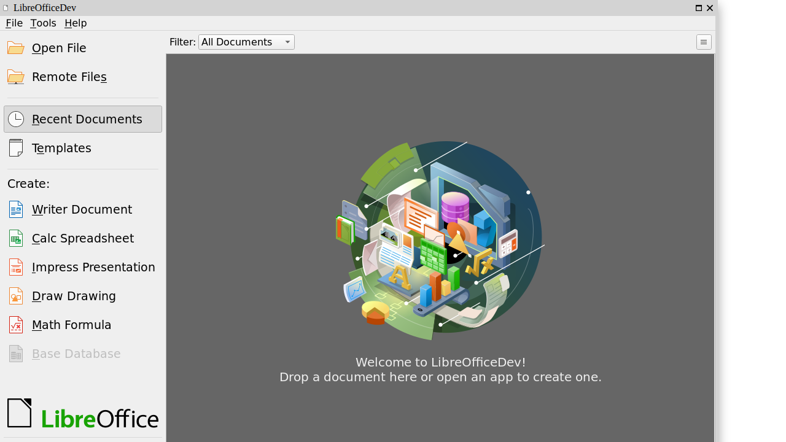
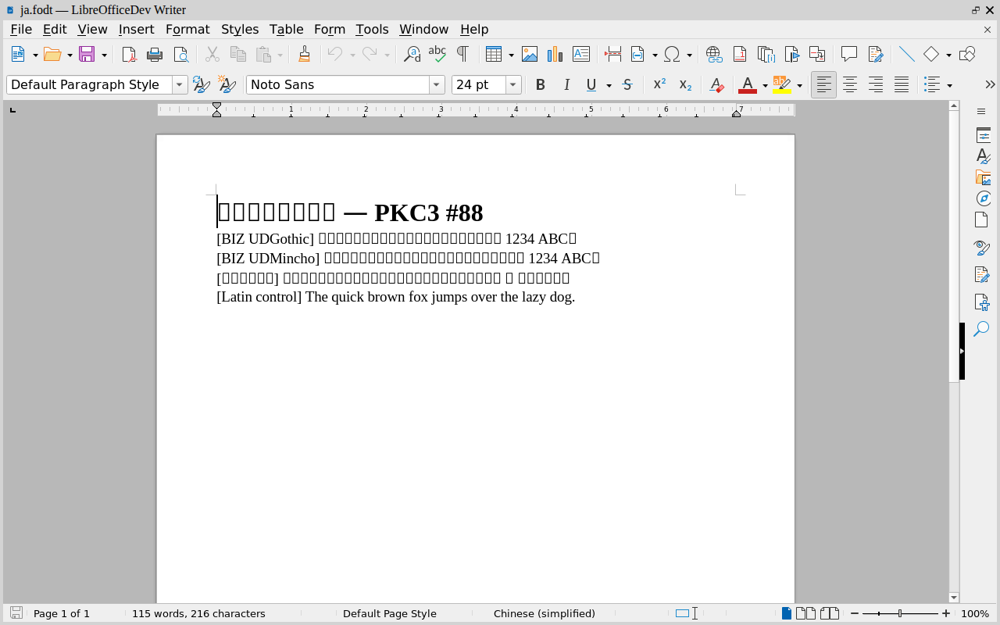
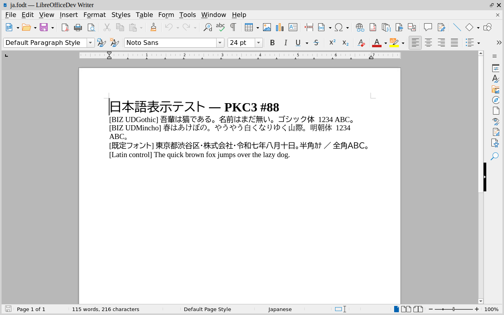
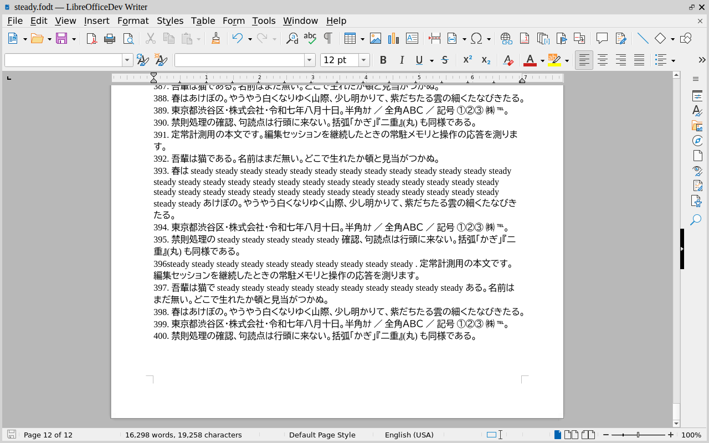
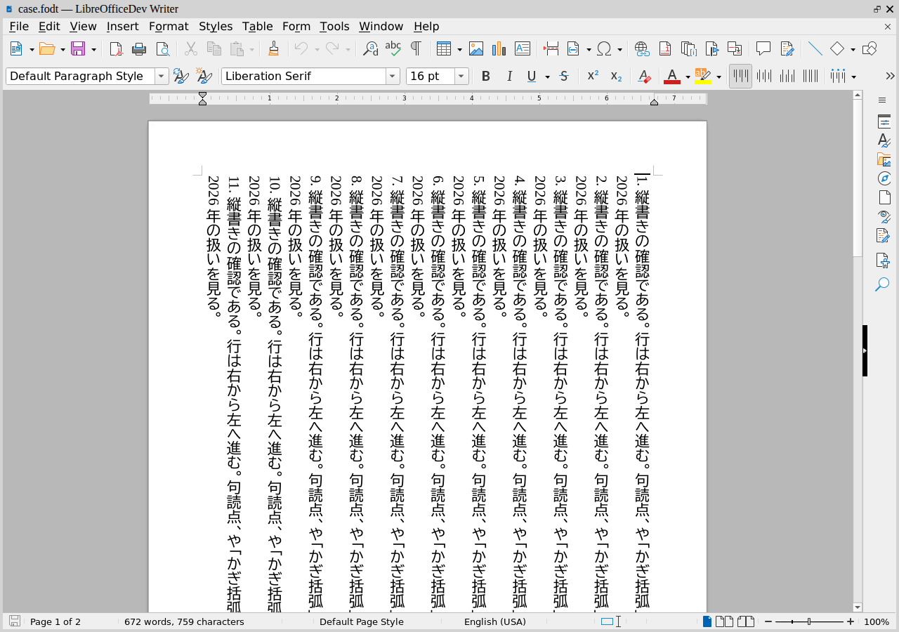
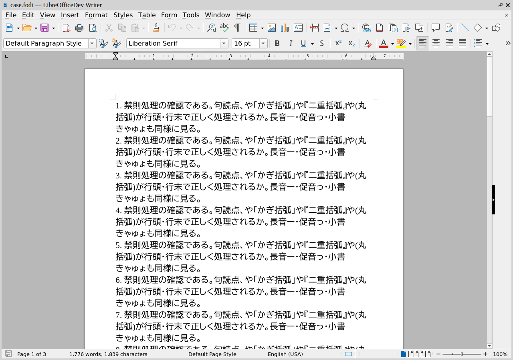
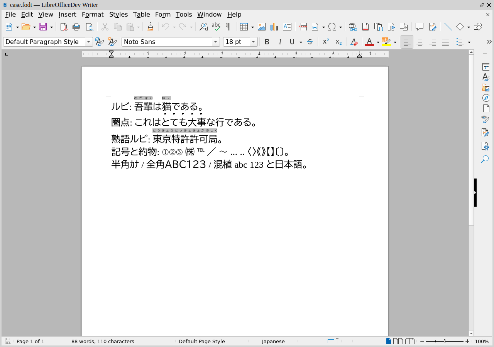
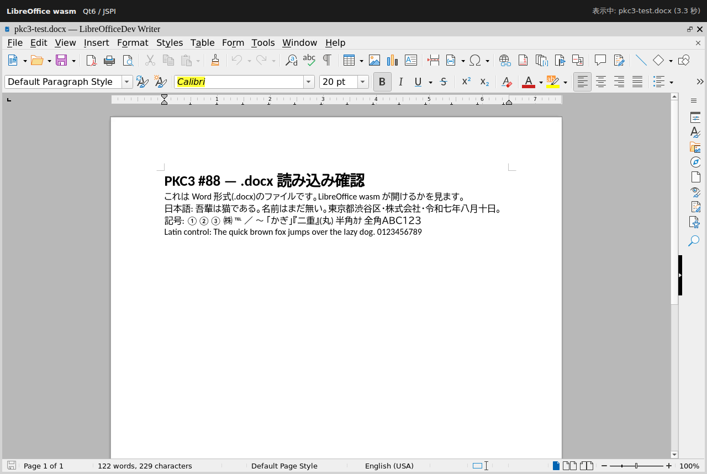

# Office 系 wasm の選定と配布・キャッシュ機構(2026-08)

> Issue #88(将来要望 → 2026-08-08 に着手 go)の「wasm の選定からスタート」の成果物。
> 裁定待ちの選定 doc である。調査は web(候補の一次情報)と repo(配布・キャッシュの現状)の
> 2 本を並列で行い、突き合わせた。

## 0. user 指示(2026-08-08。出典タグ付き = 不可侵)

> **wasmの選定からスタートしてください。デカイはずだから、一度ローカルに落としたら
> ユーザー任意でアップデートするまでは毎回のCDNからのロードをしないようにしてください。
> その辺りは他のwasmも同じ扱いになるようにしておいてください。以前にトライした時は
> pptの表示レイアウトが崩れるしWMFだっけか?Windowsの図形貼付が表示できないトラブルが
> あった。そこも含めてやりたいよね。PKCが単独でファイル閲覧・編集も備えれば、
> あっという間にOnenoteのクソ部分を超えたと俺は思う。シンプルにOnenoteは
> シームレス体験が壊れてるんだわ**

評価軸(この指示から確定):
1. **pptx のレイアウト忠実度**(過去に崩れた)
2. **WMF/EMF(Windows 図形貼付)の表示**(過去に出なかった)
3. 編集 + 往復保全(開いて保存しただけで書式が落ちない)
4. 完全ローカル動作・self-host 可・初回 DL 後はローカルキャッシュ
5. サイズは判断理由にしない(「予算度外視」「配る量は気にしない。効くのは定常」)
6. ライセンス(商用・再配布)
7. メンテの活発さ

## 0.1 user 指示(2026-08-08 追加。出典タグ付き = 不可侵)

> **見た目と編集性能が ms office に近ければ近いほど良い。日本語は絶対なのでよろしく**

評価軸に**筆頭 2 本**が加わった(§0 の 7 軸より上位):

- **A. 日本語が実用水準か** ── 豆腐(□)にならない / 行組版が崩れない / **日本語で入力できる**。
  ⚠ どれか 1 つでも欠ければ**その候補は落ちる**(「絶対」は妥協点を持たない)
- **B. MS Office への近さ** ── 見た目(UI と組版結果)と編集の応答

## 1. 候補の総括(2026-08-08 調査。詳細な出典は §6)

| 候補 | pptx 忠実度 | WMF/EMF | 編集+往復 | ライセンス | 備考 |
|---|---|---|---|---|---|
| **ZetaOffice / LibreOffice WASM** | ◎ 本物のレイアウトエンジン | ◎ コアに WMF/EMF/EMF+ 実装 | ○ 編集可(UNO API) | zetajs=MIT / コア=MPL-2.0 | ⚠ **COOP/COEP + SharedArrayBuffer 必須**(§2)。約 50MB(未検証) |
| OnlyOffice client-side(x2t wasm + sdkjs) | ◎ OOXML ネイティブ | △ コアに実装あり、**wasm 配線は未検証** | ◎ 往復は最良クラス | 🔴 **AGPL-3.0**(組込側にソース公開義務) | client-side 完結の実証 repo が複数在る |
| Collabora Online WASM | ─ | ─ | ─ | MPL | ✗ **server 必須の部品** → 除外 |
| pptx-viewer-core + emf-converter(ChristopherVR) | 高忠実を**自己申告** | ◎ EMF+ 300+ record、OffscreenCanvas 対応 | ○ 往復保存を主張 | Apache-2.0 | ⚠ 実質単独作者・第三者検証なし。2026-08 現在活発 |
| docx-preview / mammoth / SheetJS / Univer | docx・xlsx 単能 | ✗(ほぼ全滅) | ✗〜△ | Apache/BSD | 軽量閲覧レーンの部品。**EMF を軒並み落とす** |

- 旧形式(doc/xls/ppt)をネイティブで開けるのは LibreOffice エンジンだけ。x2t は OOXML への変換入力。
- 「wasm 化された libwmf / libemf2svg」の実用パッケージは npm に流通していない(発見できず)。

## 2. 🔴 突き合わせで見つかった成立条件(web 調査単体では見えなかった)

**ZetaOffice は COOP/COEP ヘッダ + SharedArrayBuffer 必須**(LibreOffice core README.wasm で確認)。
一方 PKC3 の配布は GitHub Pages で、**カスタムヘッダ不可 → COOP/COEP なし**が設計上の確定事項
(`docs/development/pkc3-major-upgrade-design-2026-07.md:229`、`storage-worker.ts:43` の
`crossOriginIsolated: false` 実測)。**そのままでは本命候補が動かない。**

回避策 = **service worker によるヘッダ注入**(coi-serviceworker 型。PKC3 は自前 SW を持つので
`sw-source.ts` に足せる)。ただし:
- COEP を `require-corp` にすると**外部画像(同意制)が CORP 無しで全滅**する。
  `credentialless` なら回避できる見込み(Chromium 系は対応)── **実機検証が要る**
- sandbox iframe(html fence)や blob: URL との相互作用も検証対象
- この検証は smoke(実ブラウザ 2 種)で行える

## 2.1 🔴 COOP/COEP の実機検証(2026-08-08。私の実測)

§2 の「そのままでは本命候補が動かない」に対する検証。**両方とも成立した**。

| 確かめたこと | 結果 |
|---|---|
| isolation 下で PKC3 が動くか | **smoke 100 件中 98 件が緑**(dist を COOP/COEP つきで配って全量) |
| ⚠ 空振り防止: 本当に isolation が効いていたか | メイン・**blob: worker の両方**で `crossOriginIsolated: true` / SAB 確保 / `Atomics` 動作を確認 |
| GitHub Pages でヘッダを付けられるか | **SW 注入で成立**(初回は非 isolated → SW が制御を握って再読込 → `crossOriginIsolated: true`) |
| 外部画像(同意制)が生きるか | 生存(COEP は `credentialless`) |

**代償が 1 つ**: SAB が使えるようになると **sqlite が別の OPFS 経路(asyncer VFS)を試して失敗し、
`console.error` を出す**(落ちた 2 件はこれ 1 原因。データと機能は無事)。起動のたびに
余計な取得と worker 生成が走るので、**isolation を入れるなら先に塞ぐ**。

⚠ **`credentialless` は Chromium 系のみ。** Safari / Firefox では `require-corp` になり、
そちらは **CORP を持たない外部画像が全滅**する。isolation を採るなら対応ブラウザの線引きが要る。

## 3. 推薦 ── 🔴 **2026-08-08 に覆した。§3.1 を読むこと**

> ⚠ 以下は**日本語要件を知る前**の推薦である。記録として残すが、**採用しない**。
> 覆した理由と現在の推薦は §3.1。


**ZetaOffice(LibreOffice WASM + zetajs)を self-host で本命とする。
ただし「選定の完了」= 次の 2 点の実機検証を先に通すこと。**

1. **COOP/COEP を SW 注入で成立させられるか**(credentialless で外部画像・sandbox iframe が
   生きるか。smoke で pin)
2. **WMF 入りの実ファイルが wasm ビルドで表示されるか**(user が過去に崩れた実物での受入試験。
   コア機能が wasm ビルドで削られていないかの確認)

理由:
- 評価軸 1・2(pptx 忠実度・WMF)を「JS 再実装」ではなく**本物のレイアウトエンジン +
  20 年物のメタファイル実装**で正面から満たす現存唯一の選択肢
- 旧形式(doc/xls/ppt)もネイティブで開ける唯一の選択肢
- MIT + MPL でライセンスが軽い(AGPL の OnlyOffice と違い、組込先のソース公開義務が無い)。
  ビルドソース公開済みで self-build 可 = CDN 有償化の人質にならない
- 50MB 級のサイズは「予算度外視」+「初回 DL 後ローカルキャッシュ」の指示に合致

**覆る条件**(どれかが判明したら再選定):
- 検証 1 が不成立(COOP/COEP が PKC3 の配布・既存機能と両立しない)→ フルエンジン案自体が
  不成立。軽量レーン(§4)単独へ
- 検証 2 が不成立(wasm ビルドで WMF が出ない)→ OnlyOffice client-side へ乗り換え検討。
  **ただし AGPL-3.0 の受け入れ裁定が必要**
- ZetaOffice のベータ終了後の配布条件が self-build の維持コスト許容外 → 同上
- 軽量レーンの pptx-viewer-core + emf-converter が実ファイル受入試験で申告通りと確認 →
  **閲覧に限っては** 50MB 無しで軸 1・2 を満たせるため、閲覧=軽量 / 編集=ZetaOffice の
  2 段構成に変更しうる

段構え: **P① 閲覧(view-only)を先に着地 → P② 編集**。編集は往復保全の受入試験
(開いて保存しただけのファイルが壊れない)を必須 gate とする。

## 3.1 🔴 推薦(2026-08-08 に差し替え)── **OnlyOffice client-side**。ただし裁定 2 件が要る

**ZetaOffice / LibreOffice WASM は日本語要件で落ちる。** 一次ソースで確認した:

| 事実 | 一次ソース |
|---|---|
| LOWA は **Qt 5.15.2**(allotropia fork)を使う | `static/README.wasm.md`「We're using Qt 5.15.2 with Emscripten 4.0.10」+ `distro-configs/LibreOfficeWASM32.conf` の `--enable-qt5` |
| その wasm プラグインに **`qwasminputcontext.cpp` が無い**(SOURCES 全 16 件を確認) | `allotropia/qtbase@5.15.2+wasm` `src/plugins/platforms/wasm/wasm.pro` |
| wasm の IME 対応は **Qt6 で入った** | `qt/qtbase@6.8` に `qwasminputcontext.cpp`(`compositionStart/Update/End`)が在る |
| 同梱フォント 27 種に **CJK がゼロ** | `zeta-24-2` の `external/more_fonts/Module_more_fonts.mk`(実際に全数を読んだ) |
| 置換表の MS 明朝 / MS ゴシックの**置換先が同梱に 1 つも無い**。游ゴシックは表に載っていない | `officecfg/registry/data/org/openoffice/VCL.xcu` |

⚠ つまり**素の LOWA では日本語が打てない**。VCL 側は `inputMethodEvent` を実装しているが、
プラットフォームプラグインが投げないので**呼ばれない**。回避するには canvas に透明な入力要素を
重ね、合成中プレビュー・確定・キー操作の UNO 化・undo 粒度・選択との整合を**全部自作**する
── PKC3 のライブエディタで最も苦労した領域を、**カーソル座標を UNO 経由でしか取れない**
より不利な条件でもう一度やることになる。加えて軸 B(MS Office への近さ)でも、見た目は
**LibreOffice そのもの**で MS Office 風ではない。**2 つの筆頭軸の両方で負ける。**

**OnlyOffice client-side(x2t wasm + sdkjs)を推す。**

| 軸 | 根拠(一次ソース) |
|---|---|
| 豆腐にならない | `ONLYOFFICE/core-fonts` に **takao-gothic**(TakaoGothic / TakaoPGothic / TakaoExGothic)。glyph 単位の fallback 機構(`common/libfont/character.js` の `IsUseNoSquaresMode` / `__fonts_ranges`)を持つ |
| **日本語で打てる** | `sdkjs/common/text_input2.js` が `["input","compositionstart","compositionupdate","compositionend"]` を listen し、**キャレット位置へ入力要素を移動**(候補窓が正しい位置に出る)。`Begin_CompositeInput` / `Replace_CompositeText` / `Set_CursorPosInCompositeText` を持つ |
| MS Office への近さ | OOXML ネイティブ設計。UI はリボン風。DOCX の font slot(ascii/hAnsi/**eastAsia**/cs)を実装 |
| 配る量 | x2t.wasm 9.7MB / sdk-all.js 9.9MB / fonts.wasm 3.6MB ── LOWA の約 250MB に対し **1.5 桁小さい**(⚠ 判断理由にはしない。事実として記録) |

**⚠ 欠けているもの(user の裁定が要る)**:

1. 🔴 **縦書きが未対応**(`DocumentServer#3738` open)/ 🔴 **ルビが出ない、しかも
   ベース文字ごと消える**(`#1152` open・confirmed-bug・2021 年から)。
   **縦書きかルビを扱う文書があるなら、OnlyOffice も落ちる。**
2. 🔴 **AGPL-3.0**。PKC3 は `package.json` が `"private": true` で LICENSE を持たない。
   組み込むと**組込先のソース公開義務**が生じうる ── これは技術ではなく**事業の判断**である。

そのほか判明した弱点(裁定には要らないが記録):**明朝が 1 本も無い**(ゴシックに落ちる)/
禁則テーブルに**小書き仮名・長音符「ー」・中黒が無い**(MS Word の日本語標準禁則より弱い。
行頭に「っ」「ー」が来うる)/ shaping の言語タグが `"en"` 固定 / 和文と欧文の別フォント指定が
UI から出せない(`#3497` open)/ 共同編集 × IME に現役の confirmed-bug(`#3720`。
PKC3 は共同編集をしないので該当しない見込み)。

**覆る条件**: ①縦書き・ルビが要件に入る ②AGPL を受け入れない ── どちらかなら
**フルエンジンは両方落ちる**。その場合は「閲覧は軽量レーン(§4)+ 編集は OS の Office へ
渡す(`ms-word:` は既に allowlist に在る)」へ方針転換する。

**未検証のまま残る最大の穴**: OnlyOffice client-side で **ＭＳ 明朝 / 游ゴシック指定の実 docx を
開き、MS Word と行数・改ページを突き合わせた実測が世の中に無い**。採用が決まったら
**最初にやるのはこれ**(user の実ファイルでの受入試験)。

## 3.2 🔴 3 択の比較表(2026-08-08。user 「どっちがいいのか決められない / 比較表を示せる?」)

判断が要るのは engine ではなく**この 3 択**である。⚠ 「実測なし」は**私が確かめていない**の意。

| | **A. OnlyOffice を組み込む** | **B. LibreOffice を組み込む** | **C. 閲覧だけ自前 + 編集は OS の Office へ渡す** |
|---|---|---|---|
| **日本語が豆腐にならない** | ○ Takao ゴシック同梱 + 字形 fallback | ✗→△ **CJK ゼロ**。注入すれば出るが、wasm は字形 fallback しないという実機報告あり | ◎ 閲覧は自前描画 / 編集は本物の Office |
| **日本語で入力できる** | ○ canvas 上の IME 実装が製品に在る | ✗ **Qt5 wasm に IME の入口が無い**。透明入力欄 + UNO で**自作**が必要 | ◎ 本物の Office |
| **縦書き** | ✗ 未対応(#3738 open) | ○ 組版機構は wasm 像に同梱(**実動作は実測なし**) | ◎ |
| **ルビ** | ✗ 出ない上に**元の文字ごと消える**(#1152 open・2021 から) | ○ 同上(**実測なし**) | ◎ |
| **禁則** | △ 小書き仮名・長音符「ー」・中黒がテーブルに無い | ○ 日本語組版の設定 UI ごと同梱(**実測なし**) | ◎ |
| **見た目が MS Office に近い** | ○ リボン風 UI・OOXML ネイティブ | ✗ **LibreOffice そのもの** | ◎ 本物 |
| **外部画像を失うか** | **失わない**(isolation 不要。ビルドフラグに `-pthread` 無し) | isolation が要る。`credentialless` なら Chromium では生存、**`require-corp` なら全滅** | 失わない |
| **対応ブラウザ** | 制限なし | `credentialless` は **Chromium 系のみ** | 制限なし |
| **ライセンス** | 🔴 **AGPL-3.0**(ソース公開義務。商用ライセンス購入で外せる可能性 ── **未確認**) | ○ MIT + MPL-2.0 | ○ 各部品 Apache/BSD |
| **配る量** | 約 23MB(x2t 9.7 + sdk 9.9 + fonts 3.6) | 約 250MB | 数 MB |
| **起動** | 実測なし | cold start 20〜90 秒(第三者・**手順の記載なし**) | 即時 |
| **実装量** | **L**(配線が主。engine は既製) | **XL**(250MB 配布 + フォント注入 + fontconfig 別名表 + **IME 自作** + isolation + sqlite の穴塞ぎ) | **M**(閲覧部品の寄せ集め + EMF) |
| **いちばんの穴** | 日本語文書で MS Word と行数・改ページが合うかの**実測が世の中に無い** | **誰も wasm で日本語を実運用していない**(issue すら 0 件) | **編集がアプリ内で完結しない** |

**決まり方(この順に見れば決まる)**:

1. **縦書き・ルビを使う文書があるか** → **ある**なら A は落ちる(B か C)
2. **AGPL を受け入れられるか**(または商用ライセンスを買うか)→ **否**なら A は落ちる(B か C)
3. 1・2 を両方クリアするなら **A**
4. A が落ちたとき、B と C の差は「**日本語入力を自作する覚悟**」── B は日本語 IME を
   canvas の上に自前で作る工程が必ず要る(PKC3 のライブエディタで最も難しかった部分の再演)。
   それを負わないなら **C**

**私の推薦: A → 落ちたら C。B は採らない。**
理由 ── B は user の 2 つの筆頭軸(**日本語**・**MS Office への近さ**)で**両方負けている**うえ、
実装量が最大で、しかも一番難しい部分(IME)が**未踏**である。B の唯一の勝ち筋は縦書き・ルビだが、
それも wasm での実動作は誰も確かめていない ── **確実な負けと不確実な勝ちの交換**になる。

**⚠ 1 と 2 は user にしか答えられない。** 1 は「その文書を書くか」、2 は事業判断である。

## 3.3 🔴 将来性・実績・組版の実装状況(2026-08-09)── **推薦を再度差し替える**

> user「onlyoffice 自体は縦書き対応を今後開発していくんじゃないの? / 未来があるというか
> libre より活発だし、eu での導入実績があると思ってるけど、どうなのか?」

**この問いが正しかった。調べた結果、§3.1 の推薦(A. OnlyOffice)を取り下げる。**
ただし**見立てとは逆向き**に動いた。

### (1) 縦書き・ルビが実装される見込み: **低**

| 事実 | 一次ソース |
|---|---|
| **ルビは未実装**。`CRuby::fromXML` が**空実装**、2 つ目の overload は `ReadTillEnd` で丸ごと読み飛ばし、`toXML` は `<w:ruby/>` を返す。`rubyBase`(親文字)はどこにもパースされない | `ONLYOFFICE/core` `OOXML/DocxFormat/Logic/RunContent.cpp`(**私が直接確認**) |
| 縦書きも未実装。列挙定数 `textdirection_TBRLV` が在るだけで、`textDirection` が内部形式へ渡るのは**表セルだけ** | `sdkjs/word/Editor/Styles.js` / `core` の BinaryWriter |
| 公式 ROADMAP(8.0〜10.0)に vertical / CJK 組版の記載が**ゼロ**。一方 **RTL には 9.x〜10.0 で継続投資**している | `ONLYOFFICE/DocumentServer/ROADMAP.md` |
| 正本 issue #1546(縦書き)は **4 年 8 か月 open**、assignee / milestone / PR なし。#1152(ルビ)は `confirmed-bug` のまま **5 年 7 か月** |  GitHub |
| CJK 系で 3 年以上 open が **5 件**(うち 4 件は開発元が `confirmed-bug` 認定済み) | GitHub |
| CJK 要望の実装実績: #487(CJK 行間)は報告から修正まで **86 か月** | GitHub |

🔑 **「活発だからいずれ実装される」は成立しない** ── 同じ開発元が RTL には投資して CJK 組版には
一項目も割いていない。これは手が回っていないのではなく**優先順位の選択**である。

### (2) ブラウザ内で動かすこと自体を、開発元が断っている

- x2t の WebAssembly 化提案(`DocumentServer#731`、CryptPad が動く実証つきで 2019 起票)は
  **開発元の返信なしで "closed as not planned"**。公式 ROADMAP にも WebAssembly の記載なし
- したがって client-side 構成は**第三者 fork**(cryptpad / xwiki-labs)に乗ることになる

### (3) その開発元は、いま fork と係争中

2026-03、EU ベンダー 12 社(Nextcloud / IONOS / Proton / Open-Xchange / XWiki ほか)が
ONLYOFFICE を fork して **Euro-Office** を発表。ONLYOFFICE は AGPL 違反を主張し、
**8 年続いた Nextcloud との提携を停止**(FSF / Software Freedom Conservancy は fork 側の解釈を支持)。
⚠ **AGPL のコードを組み込む判断が、権利者が現に fork 相手と争っている状況で行われる**ことになる。

### (4) EU 実績は逆だった

- 独の主権ワークプレイス **openDesk のオフィス部品は Collabora = LibreOffice 系**(ONLYOFFICE ではない)
- 第三者・政府ソースで裏が取れた規模: LibreOffice 系 = シュレスヴィヒ＝ホルシュタイン州
  **約 30,000 台** / デンマーク デジタル省 / openDesk。ONLYOFFICE = **リヨン市 4,000〜8,000 席**(実在の確かな実績)。他は自社の事例紹介
- 開発の量: LibreOffice/core は直近 24 か月で **21,088 commits / 著者 430 名**(昨日もコミット)、
  ONLYOFFICE は sdkjs 7,530 + core 3,817 / 著者 40・23 名(**公開ブランチの先端は 2 つとも 2026-05-26 で停止**
  ── リリース単位でまとめて公開する運用と見られるが、**現在の中身が見えない**)

### (5) 逆に、LibreOffice が部分的に生き返った

- §3.1 で「日本語が打てない」と判定した原因は **Qt 5.15.2 に IME の入口が無い**ことだった。
  **Qt 6.8 の wasm には合成処理が実装されている**(`compositionStart/Update/End` / preedit。**私が直接確認**)
- TDF が 2026-05-27 に **Qt6 + WebAssembly のブラウザ版**を公式戦略として発表(二次情報。
  一次の TDF blog は egress ブロックで未読)
- ⚠ **まだ届いていない**: `distro-configs/LibreOfficeWASM32.conf` は本日時点の master でも
  **`--enable-qt5`**(**私が直接確認**)。発表どおりプロトタイプ段階

### 🔴 差し替え後の推薦

**A(OnlyOffice を組み込む)は採らない。** 理由を 1 行で:
**土台を開発元が否定していて(#731 not planned)、その開発元が fork 相手と係争中で、
かつ日本語組版(縦書き・ルビ)は実装の痕跡が一次情報のどこにも無い。**

**B(LibreOffice)は「待つ」。** 唯一の致命傷(IME)は **Qt のバージョン問題**であり、
公式の進む先がそのまま解決になる。ライセンスも MPL で軽い。ただし**今日は使えない**。

**⚠ C(閲覧だけ自前)も無条件には推せない。** user の過去の失敗そのもの
(「ppt の表示レイアウトが崩れる / WMF が表示できない」)が、まさに軽量レーンの弱点である。
**採否を決める前に実ファイルで受入試験をする** ── これが次の一手。

**次の一手(裁定不要・すぐできる)**: user が過去に崩れた **実物の ppt/pptx と WMF 貼付文書**を
fixture にして、軽量レーン(pptx-viewer-core + emf-converter)に通し、**崩れるかどうかを見る**。
⚠ WMF が 1 つも入っていない fixture で「表示できた」と言わない(ゼロ件の次元は測っていない次元)。

## 3.4 🔴 裁定(user 指示 2026-08-09。出典タグ付き = 不可侵)と、そこから決まる形

> **qt6 のブラウザ版を先取りする方針で閲覧優先で実装 / 可能なら独自ビルドしてしまえ**

- 採るのは **B(LibreOffice)**。ただし TDF の到着を待たず**先取り**する
- **閲覧を先に出す**(編集は後)
- **自前ビルドしてよい**(「可能なら」= 実現性は測って判断する)

### 3.4.1 ⚠ **一度読み違えた**(2026-08-09)── ページ画像に焼く案は user が却下

私は「閲覧だけなら Qt を外し、ページを PNG に焼いて出す」と提案した。**user 却下**:

> **その導線はダメです / PDF を閲覧したいわけじゃない**

🔑 **ページを画像に焼いた時点で、それは PDF ビューアと同じもの**である ── 文字が選べず、
検索できず、**編集へ繋がらない**。「図は描いたら焼く」は**図**の規律であって、
**文書に適用してはいけない**(図は絵だが、文書は文字である)。
⚠ 閲覧のためだけに Qt を外すと、**編集へ繋がる道ごと捨てる**ことになる。

### 3.4.2 出すもの ── **本物の LibreOffice の面**を、まず閲覧モードで

- **Qt6 で建てる**: Qt5 では日本語が打てない。編集を後から乗せるなら最初から Qt6 で建てる
  = user 指示の「**先取り**」
- **閲覧を先に出す**: 閲覧なら IME が要らないので、**ビルドさえ通れば出せる**
- **自前ビルドの見返り**: 配布されている LOWA は Qt5 で、**CJK フォントも入っていない**。
  自分で焼けば**両方とも建てた時点で解決する**

### 3.4.3 自前ビルドの実現性(この箱の実測)

| | 実測値 |
|---|---|
| 空きディスク | **28 GB**(書込 149 MB/s) |
| CPU / メモリ | **4 コア** / 15 GB |
| emscripten | **未導入**(emsdk の取得から) |

LibreOffice の wasm ビルドは数十 GB 規模なので、**この箱で完結させるのは苦しい**。
現実的な線は **CI(大きめの runner)で焼いて生成物だけ持ち込む**形。
⚠ ただし PR gate は「速い lane に限定」(プロセス指示)なので、**engine のビルドは
PR gate に載せない** ── nightly / 手動 dispatch / 別リポジトリの release artifact にする。

## 3.5 🔴 Qt6 + WASM の自前ビルド ── 手順と関門(2026-08-09)

**結論: 道は既に上流に通っている。ゼロから作るのではなく、experimental な経路を叩き起こす。**

### 3.5.1 一次ソースで確認した事実(私が実物を読んだ)

| 事実 | 場所 |
|---|---|
| **Qt6 × Emscripten の分岐が upstream master に在る** | `configure.ac:14293-14297`(`libqwasm.a` / `wasm_shell.html` を探して無ければ `AC_MSG_ERROR`)、`:14313`(`-lQt6BundledPcre2 -lQt6BundledZLIB -lqwasm -sGL_ENABLE_GET_PROC_ADDRESS`) |
| **呼び方の制約** | `configure.ac:12691` ── `DISABLE_DYNLOADING=TRUE`(wasm は常にそう)かつ GUI 付きなら **VCL プラグインはちょうど 1 個**。`--enable-qt6` を足すだけでは `R="qt5 qt6"` で落ちる |
| 🔴 **リンクに最大 64GB RAM** | `static/README.wasm.md:87`「This way the LO WASM possibly needs 64GB RAM」。同じ場所に回避策(`-s WASM_BIGINT=1` / `ASSERTIONS=1` / `-g3` で WASM の書き直しを避ける)も書いてある |
| **Qt6 wasm は IME を持つ** | `qtbase@6.5/6.8/6.10/6.11` に `qwasminputcontext.cpp` が在る(5.15 は **404**) |
| CJK フォントは **1 つも無い** | `external/more_fonts/Module_more_fonts.mk`(全 27 種を確認) |

**正しい configure の呼び方**:
```
--with-distro=LibreOfficeWASM32 --disable-qt5 --enable-qt6
(QT6DIR は wasm 版 Qt6 の prefix)
```

### 3.5.2 関門(重い順)

1. 🔴 **リンク時のメモリ** ── 公式が最大 64GB と言っている。**この箱は 15GB**、GitHub の
   標準 runner も 16GB。→ **大きい runner か自前マシンが要る**。README の回避策を
   先に試す価値はある
2. **Qt6 は host build が追加で要る**(Qt5 には無かった要件)── 「同じ版の Qt をホスト用に
   1 回、wasm 用にもう 1 回」。ビルド時間が単純に増える
3. **distro-config も CI も無い** ── 上流が壊れても誰も気づかない経路。**自分で config を
   持ち、自分で CI を張る**必要がある(⚠ PR gate には載せない ── プロセス指示)
4. **取りこぼしを自分で直す** ── `EMSCRIPTEN_INTEL_GCC.mk` の `gb_EMSCRIPTEN_QTDEFS` が
   `ifeq ($(ENABLE_QT5),TRUE)` になっており **Qt6 に適用されない**
5. **thread build → COOP/COEP 必須** ── LO 側が `-pthread -s USE_PTHREADS=1` を要求する
   (`EMSCRIPTEN_INTEL_GCC.mk`)ので Qt も `-feature-thread`。→ §2.1 で**成立を実機確認済み**

⚠ **emsdk の食い違いは関門ではない**: LOWA は 4.0.10、Qt 6.10/6.11 の推奨は 4.0.7 で
**同じ major.minor**。しかも Qt 公式が「ソースからビルドするなら表の値は*最低*版」と明記。
LO は Qt を CMake 経由で consume しないので、Qt 側の版一致 `FATAL_ERROR` も発火しない。

### 3.5.3 CJK フォントを焼き込む(自前ビルドの本当の見返り)

`external/more_fonts` に CJK は無いので、**5 か所**を足す(`fonts_noto_sans` が雛形):
`download.lst` / `UnpackedTarball_noto_cjk_jp.mk`(新規)/ `ExternalPackage_noto_cjk_jp.mk`(新規)/
`Module_more_fonts.mk` / `Repository.mk` の `gb_Helper_optional(MORE_FONTS, ...)`。
wasm は `--with-fonts` が既定 ON なので、これで `ooo_fonts` 経由で `soffice.data` に入る。

⚠ **`soffice.data` は eager preload**(= 常駐)。配る量は問わない(不可侵指示)が、
**常駐メモリは問う**ので、ここだけはサイズが判断材料になる。

#### 🔴 実地調査(2026-08-09、LibreOffice core を実物で確認)── 穴は **4 つ**あった

「フォントを 1 つ足す」では済まない。**数えたら 4 つ**で、どれも独立に効く:

| # | 穴 | 実測 |
|---|---|---|
| 1 | **同梱フォントに CJK が 1 つも無い** | `external/more_fonts/*.mk` を CJK / han / jp で grep → **0 件** |
| 2 | **`VCL.xcu` の置換先が全部「同梱に無いフォント」** | `msgothic` → `mspgothic;hiraginokakugothicpronw3;…;ipagothic;gothic;arialunicodems;lucidaunicode`<br>`msmincho` → `ipamincho;hiraginominchopronw3;…;heiseimin;arialunicodems;lucidaunicode`<br>⚠ **Noto は 1 つも鎖に入っていない** |
| 3 | 🔴 **游ゴシック / 游明朝(`yugothic` / `yumincho`)は登録すら無い** | `VCL.xcu` に node が**存在しない**。⚠ これは **Office 2016 以降の日本語既定書体**であり、実際の `.docx` / `.pptx` が最も多く指定してくる名前である |
| 4 | **fontconfig の別名に和文が 0 件** | `external/more_fonts/fc_local.snippet` / `postprocess/fontconfig/fc_local.snippet` は Arial→Liberation / Calibri→Carlito / Cambria→Caladea など**ラテンのみ**。gothic / mincho / CJK は **grep 0 件** |

🔑 **user が挙げた「ppt の表示レイアウトが崩れる」に直結する。** 字が出るかどうか(#1)と、
**指定された書体に何が当たるか**(#2〜#4)は別問題で、後者を放置すると
「文字は出るが行長・行数が原文と違う」= レイアウト崩れになる。

⚠ **「同梱フォントを足したから日本語 OK」と言わない。** 主張してよいのは
**実ファイルを開いて、指定書体に何が当たったかを見たあと**である
(検証の規律「下流の結果だけを見る test は別経路に救われる」と同型)。

#### 選定の論点(**未裁定** ── 実測を添えて user に出す)

- **どの和文フォントを焼くか**: 日本語のみ(Noto Sans JP 系)/ 汎 CJK(Noto Sans CJK JP)。
  ⚠ 「日本語は絶対」(user 指示 2026-08-09)は満たされるが、**中文・韓文を落とすかどうか**は
  user の動線の話なので勝手に決めない(不可侵「記法を減らすことは動線を減らすこと」と同じ向き)
- **明朝を入れるか**(`ＭＳ 明朝` 指定文書のため)── ゴシックだけだと #2 の鎖が
  明朝に当たらず、見出しと本文の対比が消える
- **置換表を触るか、fontconfig の別名で寄せるか** ── #2/#3 は `VCL.xcu`、#4 は
  `fc_local.snippet`。⚠ **両方に同じ判定を書かない**(規律「判定を増やさない。1 か所へ寄せる」)

### 3.5.4 「動く」証拠

`QTBUG-136687`「Wasm LibreOffice no longer gets keyboard input events」── **Qt6 dev に対して
ビルドされた LibreOffice wasm** の不具合報告で、再現手順が「スタートセンターで Writer を
クリックして x を打つ」。Qt 6.9.1 / 6.10.0 で Fixed。
⚠ 二次情報(`bugreports.qt.io` は egress ブロックで原文未読)。**この 1 点は自分の目で
確認できていない**。

### 3.5.5 次の一手

1. **この箱で toolchain だけ先に通す** ── emsdk 4.0.10 + Qt 6.11 の host build と wasm build。
   Qt だけなら LO より桁違いに軽いので、ここで**半分の不確実性が消える**
2. **LibreOffice のリンクは大きいマシンへ** ── 64GB の壁。README の回避策を当てて
   どこまで下がるかを測ってから機材を決める
3. **CJK フォントのサブセットを先に作る**(ビルドと独立に進む)
4. ⚠ 上流(TDF の Jonathan Clark / Michael Weghorn ら)と衝突しないよう、着手前に gerrit を
   見る ── **本セッションからは `gerrit.libreoffice.org` に到達できない**

## 3.6 🔴 実際に建てた記録(2026-08-09)── Qt6 側は**通った**。詰まりはネットワーク

**やったこと**(この開発コンテナ。4 コア / 15GB RAM / 空き 28GB):

| 段 | 結果 |
|---|---|
| emsdk **4.0.10** 導入 | ✅ `emcc 4.0.10` |
| qtbase **6.11** 取得 | ✅ 実物のツリーに `qwasminputcontext.cpp` / `.h` が在ることを確認 |
| Qt6 **host** ビルド | ✅ `moc` / `Qt6CoreTools` / `Qt6GuiTools` / `Qt6WidgetsTools` |
| Qt **6.11.3** **wasm** ビルド(`-feature-thread`) | ✅ `libqwasm.a` + `wasm_shell.html` |
| LibreOffice `configure` が Qt6 を受理 | ✅ `ENABLE_QT6=TRUE` / `ENABLE_QT5=` / `VCL_PLUGIN_INFO= qt6` |
| `make` | ❌ **外部 tarball を取れない** |

🔑 **「distro-config も CI も無い experimental な経路」が生きていることを、外から確認した。**

### 詰まった場所 ── コードではなく egress ポリシー

```
https://dev-www.libreoffice.org/src/libabw-0.1.4.tar.xz
Proxy tunneling failed: Forbidden
```
LibreOffice は外部依存 tarball 約 100 件をこのホストから取る。**このコンテナからは到達不可**
(実測: `curl` が 000、プロキシは CONNECT に 403)。ディスクでも CPU でもメモリでもない。
→ **ビルドは CI へ出す**。手順は `.github/workflows/office-wasm-build.yml`(`workflow_dispatch` のみ。
⚠ PR gate には載せない)。

### 手順に必ず要る 3 行(実際に踏んだ罠)

1. 🔴 **`moc` / `rcc` / `uic` は host の道具**で cross build の install に入らない。
   LibreOffice の configure は `$QT6DIR/libexec` と `$QT6DIR/bin` しか見ない
   (`configure.ac:14354-14357`)ので、**host から繋がないと落ちる**
2. **host を `-no-gui` で建ててはいけない** ── wasm 側の Gui/Widgets が host の
   `Qt6GuiTools` / `Qt6WidgetsTools` を参照する
3. **`-xcb` を強制しない** ── xcb の dev が無いと feature condition 違反で configure が落ちる。
   host は道具を配るだけなので画面は要らない
   (ほかに Perl の `Archive::Zip`、`flex` / `gperf` / `nasm` / `xsltproc` が不足していた)

### 机上の予測が実測で裏付けられた / 覆された点

- ✅ **emsdk の版ズレは関門ではない** ── Qt 6.11 推奨 4.0.7 に対し 4.0.10 で configure が通り、
  出たのは `WARNING: Using Emscripten version 4.0.10 with this Qt` **1 行だけ**
- ❌ **「この箱の制約はディスクと RAM」という見立ては外れた** ── 実際に止めたのは**ネットワーク**。
  ディスクは 23GB 残っていた

### 残る最大の未知 → **解けた**(run 31307638176)

**リンク時のメモリ**(公式 README が「possibly needs 64GB RAM」)は**杞憂だった**。
標準 runner(16GB)で `make` が完走し、`/usr/bin/time -v` の **peak RSS は 4.95 GB**。
`soffice.data` 87.6MB も生成された。落ちたのは**最後の `soffice.js` のリンクだけ**である。

## 3.7 🔴 Qt6 経路の欠落と、それを **2h40m 待たずに** 検証する方法(2026-08-09)

### 症状と原因

`wasm-ld: undefined symbol: FT_Outline_Transform`(ほか `FT_*` 多数、すべて
`libcairo-lo.a(cairo-ft-font.c.o)` 由来)。

`RepositoryExternal.mk` を読むと `gb_LinkTarget__use_cairo` は **`freetype_headers`
しか取っていない**(ヘッダのみ・libs 無し)。Qt5 のリンク行には
`-lQt5FontDatabaseSupport` が在って Qt 側の freetype で解決されるが、
**Qt6 のリンク行(`configure.ac:14313`)にはフォント系が 1 つも無い**。
上流の Qt6 × Emscripten はまだ誰も最後まで通していない、という状況証拠でもある。

直し: `vcl/Library_vclplug_qt6.mk` の `use_externals` に **`freetype`** を並べる
(`build/office-wasm/patch-qt6-freetype.py`)。`gb_LinkTarget__use_freetype` は
`SYSTEM_FREETYPE` 分岐の**外**で定義されているので Emscripten でも有効で、
`FREETYPE_LIBS` をリンク行へ足す。

⚠ **最初は `use_static_libraries` で足そうとして誤った。** `StaticLibrary_freetype` が
建つのは `COM=MSC` のときだけ(`external/freetype/Module_freetype.mk`)で、Emscripten では
ExternalProject である。上流の `vcl/Library_vcl.mk` の条件が `WNT-TRUE` なのには理由がある。

### 🔑 **`gb_DEBUG_STATIC=1` で、ビルドせずにリンク構成を検める**

user 指示「無策で頭から回すの違くない?」への答え。**1 語変えて 3 時間回す**のではなく、
gbuild に**実行ファイルへ集まる externals を印字させる**:

```bash
make gb_DEBUG_STATIC=1 -n Executable_soffice_bin > /tmp/dbgstatic.log 2>&1
grep -o "expand_executable externals for Executable/soffice.js: .*" /tmp/dbgstatic.log
```

`solenv/gbuild/static.mk` の `gb_LinkTarget__expand_executable` が
**transitive に集めた externals を実行ファイルへ当て直す**ので、この 1 行が
「リンク行に何が載るか」の答えになる。`make` は tarball が無くて途中で止まるが、
**印字は parse 時に出る**ので止まってよい ── 所要 **4 分**。

実測(2026-08-09):

| | soffice.js の externals 末尾 |
|---|---|
| パッチ **有** | `… wpd wpg xmlsec **freetype** qt6` |
| パッチ **無**(対照群) | `… wpd wpg xmlsec qt6` |

⚠ **対照群を取ること** ── `freetype_headers` は cairo 経由で元から在るので、
「freetype という字がある」だけでは効果を主張できない。外して消えることまで見る。

⚠ **この検証が示すのは「`FREETYPE_LIBS` がリンク行に載る」ところまで**である。
リンクが通ることまでは示していない(`FT_*` 以外の未定義が残っている可能性は消えない)。
主張の範囲を超えて読まない。

→ **実際、残っていた。** 次の §3.8。

## 3.8 🔴 2 つ目の欠落 ── 例外モデルの食い違い(2026-08-09)

FreeType を直した run(31334536443)で `FT_*` は **1 件も出なくなり**、`make` は
2h40m52s → **3h04m41s** と 24 分先へ進んだ。そこで出た次のエラー:

```
wasm-ld: error: libQt6Core.a(qglobal.cpp.o): undefined symbol: __resumeException
```

**例外処理 ABI の食い違い**である。両側を実物で読んだ:

| | 例外モデル | 出典 |
|---|---|---|
| Qt(既定) | **JS 例外**(`-fexceptions`) | `qtbase/configure.cmake:1022-1026` ── `wasm-exceptions` は **`AUTODETECT OFF`** |
| LibreOffice | **native Wasm 例外** | `gb_EMSCRIPTEN_EXCEPT = -fwasm-exceptions -s SUPPORT_LONGJMP=wasm`(`EMSCRIPTEN_INTEL_GCC.mk:44`) |

`__resumeException` は **JS 例外ランタイム側の実体**なので、混ぜると解決されない。
直し: Qt の wasm 側を **`-feature-wasm-exceptions`** で建てる ── 有効にすると Qt も
`-fwasm-exceptions` + `-s SUPPORT_LONGJMP=wasm` を付ける(`QtWasmHelpers.cmake:29-42`)ので、
**LO と完全に一致する**。

⚠ **同型の食い違いを他にも探して、無いことを確かめた**(3 時間かけてから 3 つ目に気づくのを避ける):

- **pthread**: LO は `-pthread -s USE_PTHREADS=1`、Qt は `-feature-thread` で `-pthread` → **一致**
- **JSPI**: LO 側は既定 off(この run の `config_host.mk` で `ENABLE_EMSCRIPTEN_JSPI=` を実見)
  → Qt に `-feature-wasm-jspi` は**足さない**

### 🔴 キャッシュ鍵は**構成フラグから導出する**

⚠ 鍵を `qt-…-v1` と固定していると、構成を変えても**古い Qt が復元されて同じエラーが
再現する** ── 「直したのに直らない」に見え、原因を別の場所に探しに行く。
手で `-v2` に上げる運用は忘れるので、フラグを file
(`build/office-wasm/qt-wasm-configure.args`)へ出し、`hashFiles(...)` で鍵に織り込んだ。

### 書きながら潰した 2 つの罠(どちらも「緑のまま間違う」型)

1. **検査の当て先が間違っていた。** `QT_WASM_EXCEPTIONS` は install のどこにも現れず、
   **正しく建っても落ちる検査**だった。手元の install を実見して
   `#define QT_FEATURE_wasm_exceptions -1` を見つけ、そこへ当て直した(有効なら `1`)
2. **行で分割すると `-nomake examples` が空白込みの 1 引数になる。**
   引数境界を `printf '[%s]\n'` で印字して確認し、語分割へ直した

## 3.9 ⚠ **リンクは通った**(run 31344100469、2026-08-10)── ただし**動かなかった**(§3.10)

**LibreOffice for WebAssembly を Qt6 で建てることに成功した。** job 全体 success。

| 生成物 | サイズ |
|---|---|
| `soffice.wasm` | **156,496,181 B**(149 MiB) |
| `soffice.data` | 87,661,735 B(83.6 MiB) |
| `soffice.js` | 836,819 B |
| `qtloader.js` | 12,135 B |
| `bindings_uno.js` | 739,337 B |
| artifact zip 合計 | 81,304,362 B(77.5 MiB) |

### ビルド時間 ── 「毎回 3 時間」は 1 回で終わった

| run | Qt | LO `make` | job 合計 |
|---|---|---|---|
| 31334536443(全部冷間) | 26m05s | **3h04m41s** | ~3h35m |
| 31344100469(Qt は再構成で建て直し / ccache・tarball 温間) | 18m35s | **16m02s** | **37m30s** |

ccache: 1 回目 hit **2.88%**(13,197 miss)→ 2 回目は `make` が 16 分。
外部 tarball 525MB もキャッシュ済みで、約 100 件のダウンロードが消えた。
**Qt を再構成しなければ、次は 20 分程度**の見込み。

### ⚠ ここまでで**言えないこと**

- **1 度もブラウザで動かしていない。** 「建った」は「動く」ではない
- `TOTAL_MEMORY=1GB`(`EMSCRIPTEN_INTEL_GCC.mk:18`)+ `soffice.data` 83.6MiB の
  eager preload ── **常駐メモリは実測が要る**(不可侵指示「効くのは定常」)。
  配る量(245MB)は判断理由にしないが、**常駐は判断理由になる**
- 日本語はまだ**豆腐**のはず(§3.5.3 の穴 4 つは未着手)

→ **実際、動かなかった。** 次の §3.10。

## 3.10 🔴 「建った」と「動く」の間に 3 つあった(2026-08-10)

§3.9 で「通った」と書いた版は、**ブラウザで 1 度も UI が出なかった**。
以下は、そこから実測で辿った 3 段である。

### ⚠ まず、私の成功判定が間違っていた(run 31350624048)

probe は `ok:true` を返したが、中身は:

    "wasm": { "hasModule": false, "canvases": 0 }
    "consoleErrors": ["pthread_create: could not find canvas with ID \"#qtcanvas\" ..."]

判定を「`#screen` が `block`」= Qt の `onLoaded` に置いていたため、
**画面が空でも成功**になっていた。🔑 主張したいのは「LibreOffice の面が出た」
なので、**大きさを持つ canvas が `#screen` の中に在ること**へ書き直した
(`onLoaded` は途中経過として別欄に残す ── 消すとどこまで進んだか分からない)。
3 題材で検品し、**「onLoaded だけ出て canvas 0」が落ちる**ことを確かめた。

### (3) `#qtcanvas` ── Qt5 の canvas id を Qt6 に渡していた

`desktop/Executable_soffice_bin.mk:70` が `PROXY_TO_PTHREAD` + GUI のとき
`-sOFFSCREENCANVASES_TO_PTHREAD=#qtcanvas` を渡す。⚠ **上流の条件は Qt5/Qt6 を
区別していない**。Qt6 は `#screen` の中へ動的に canvas を作るので、この id は無い
(qtbase を `qtcanvas` / `OFFSCREENCANVAS` / `PROXY_TO_PTHREAD` で grep して全部 0 件)。

🔴 **警告ではない。** emscripten `libpthread.js:730` は canvas が無いと
`error = EINVAL; break;` として **`pthread_create` を失敗させる**。
`-sPROXY_TO_PTHREAD=1` では**その pthread が `main()` 本体**なので、
**LibreOffice の main が 1 度も走らない**。

### (4) 🔑 そもそも**組み合わせが違った** ── Qt6 のモードは JSPI + 非 PROXY

(3) を直すと `main()` は走り、次はこれで落ちた:

    TypeError: Cannot read properties of undefined (reading 'chrome')
      ← qtbase qwasmclipboard.cpp:168  val::global("window")["chrome"]

**worker に `window` は無い。** ここで「4 つ目の個別バグ」と数えかけたが、
LO 側を読むと Qt6 対応は**ひとつのモードとして**書かれていた:

    ENABLE_QT6 && HAVE_EMSCRIPTEN_JSPI && !HAVE_EMSCRIPTEN_PROXY_TO_PTHREAD

`QtInstance.cxx` に 7 箇所、`.hxx` 2、`QtTimer.cxx`、`scheduler.cxx` 2 ── 計 8 file。
**このモード専用の並行機構** `comphelper/emscriptenthreading` まで在る。
私は既定(JSPI off / PROXY_TO_PTHREAD on = **Qt5 用の組み合わせ**)で建てていた。

🔑 **個別のバグを 1 つずつ潰す前に、組み合わせが正しいかを疑う。**
(3) の `#qtcanvas` は、正しいモードなら**そもそも出ないフラグ**だった。

### (5) Qt の版 ── LO の JSPI export は **6.9 にしか無い**

JSPI モードで建てると、リンクで:

    wasm-ld: symbol exported via --export not found: …qstdweb::EventListener…

LO はこの Qt シンボルを 2 か所で名指しする
(`desktop/CustomTarget_soffice_bin-emscripten-exports.mk:25` /
`EMSCRIPTEN_INTEL_GCC.mk:36`)。生むのは Qt **6.9** の `qstdweb.cpp:754-758`:

```cpp
emscripten::class_<EventListener>("QtEventListener")
    .constructor<uintptr_t>()
    .function("handleEvent", &EventListener::handleEvent);
```

4 ブランチを実際に fetch して数えた:

| Qt | `qstdweb.cpp` の EventListener | embind 登録 |
|---|---|---|
| **6.9** | **7** | **3** |
| 6.10 / 6.11 / 6.12 | 0 | 0 |

6.10 で `QWasmSuspendResumeControl` へ置き換えられて消えている。
⚠ 版だけ替えて別の壁に当たらないよう、6.9 に `-feature-wasm-exceptions` /
`-feature-wasm-jspi` が在ることも `configure.cmake:1009/1017` で先に確認した。

#### 🔑 **6.9 は上下から挟まれて一意に決まる**(2026-08-10 追記)

当初は上限 1 点だけで「6.9」と判断していたが、**下限も付いた**:

| 境界 | 根拠 |
|---|---|
| 上限 **≤ 6.9** | `qstdweb::EventListener` の embind 登録が **6.10 で削除**(上表) |
| 下限 **≥ 6.9** | `-feature-wasm-jspi` が **Qt 6.9 で新設** ── `qt_feature("wasm-jspi"` は **6.8 に 0 件 / 6.9 に 1 件**(両ブランチを fetch して実測)。LO の Qt6 モードは JSPI を要求するので 6.8 以下では建てられない |

⚠ **6.9 以外に選択肢が無い。** そして 6.10 で上限が切れている以上、
**この経路は Qt 側の追従が止まった行き止まり**でもある(LO master に
`QWasmSuspendResumeControl` へ追従する commit は見つかっていない)。
採用の是非を判断するときは、この事実を材料に入れること。

#### 上流の先行事例(⚠ 二次情報 ── 私は原文を読めていない)

並列調査が拾った範囲では、LO の当該 commit(2025-02)自身が
「Qt dev を `-feature-wasm-jspi` で建て、emsdk 4.0.3 / Chrome 132 で動いた」と
書いているという。**この 1 点は裏取りできていない**(GitHub の HTML 経由の要約)。
ただし、少なくとも**誰かが一度は通した経路である**ことの傍証にはなる。

⚠ 併せて、上流自身が wasm ビルドを
**"still experimental and known to occasionally hang and crash"** と書いている。
「建った」「起動した」のあとに**安定性**という別の関門が残る。

### この期間に置いた「早く鳴る門」3 つ

どれも**リンクまで 16 分待たずに**落とすためのもの:

1. **Qt の構成が生成物に反映されているか** ── `qconfig.h` の
   `#define QT_FEATURE_wasm_{exceptions,jspi} 1`。⚠ 最初 `QT_WASM_EXCEPTIONS` を
   見ようとしたが install のどこにも無く、**正しく建っても落ちる検査**だった
2. **LO のモードが立っているか** ── `config_host.mk` の
   `ENABLE_EMSCRIPTEN_JSPI=TRUE` / `ENABLE_EMSCRIPTEN_PROXY_TO_PTHREAD=`(空)
3. **LO が要求する Qt シンボルが在るか** ── `llvm-nm` で `libQt6Core.a` を見る。
   ⚠ **Qt ビルド step の中ではなく独立の step**に置いた(cache から復元した古い Qt にも
   効かせる)。⚠ シンボル名は**直書きせず LO 側から抽出**して突き合わせる。
   ⚠ 正の対照(`nm` の出力が 1000 行超)を先に主張し、空 archive に「無い」と言わせない

⚠ **`make -n` で `OFFSCREENCANVAS` の消滅を見る検査は空振りだった**(対照群も 0 件)──
tarball の段で止まってリンク行に到達しないため。生成された `soffice.js` を
見る形へ直した。**検査を書いたら対照群を取る。**

## 3.11 ✅ **動いた ── 日本語も出た**(2026-08-10)

独自ビルドした LibreOffice(Qt6 / JSPI)が**実ブラウザで起動し、Writer で日本語文書を
組んだ**。§3.9〜§3.10 で「建ったが動かない」と書いた状態は解消している。



### 🔴 まず訂正 ── 「動かない」は**私の観測点の誤り**だった

§3.10 で判定を `onLoaded` から「`#screen` の中に大きさを持つ canvas が在ること」へ
直した。向きは正しかったが、**書き方が間違っていた**:

```
#screen > #qt-shadow-container ─⟨shadowRoot⟩→ .qt-screen
  → #qt-window-1 → .qt-window > canvas.qt-window-canvas   (1165x744)
```

Qt 6 の面は **shadow root の中**に在る。`querySelectorAll` は shadow 境界を越えないので、
`#screen.querySelectorAll('canvas')` は**動いていても永遠に 0 枚**を返す。私はその 0 を
信じて、在りもしないデッドロックを何時間も追った ── mailbox / JSPI / スレッドの CPU 時間まで
計装したが、**同じ run が撮っていた screenshot には Start Center が完全に描かれていた**。

🔑 **数える前に、まず見る。** 視覚を持つものを「数えた値」だけで判定するときは、
**同じ run で screenshot を撮り、必ず 1 度は目で見る**。
🔑 CLAUDE.md「検査の『主張そのもの』が間違っていることがある」の 2 例目。1 例目は
「守れない条件」、今回は「**そもそも到達できない探索経路**」── どちらも*緑に見える / 赤に見える*
だけで、**主張とは無関係**だった。
🔑 対策として probe に**対照群**を入れた:境界を越えない `shallow` の枚数を併記し、
`canvases > 0 && shallow === 0` が正常であることを結果 JSON に残す
(`build/office-wasm/boot-probe.mjs`)。

### 実測(手元 `/opt/pw-browsers/chromium`、COOP/COEP、persistent profile)

| 項目 | 値 |
|---|---|
| 起動 → 面が出るまで | **3.98 秒** |
| 常駐 RSS(対照群 = 同条件の空ページとの差) | **+636.6 MB**(822.7MB → 1474.5MB) |
| `measureUserAgentSpecificMemory()` | 2.28 GB |
| canvas | 1 枚 1165x744(`shallow` は 0 = 想定どおり) |
| 起動後の console error | 2 件のみ(`Blocking on the main thread` 警告 / `__syscall_mprotect` 未対応警告) |

⚠ この 636.6MB は **Start Center を出しただけの値**。不可侵指示「効くのは定常」に照らすと、
**編集セッションを続けたときの推移**をまだ測っていない ── boot 窓だけで定常を語らない。

### 日本語 ── 同梱フォントには **CJK が 1 つも無い**

`soffice.data`(83.6MB)に入っているフォントは **128 file / 51.2MiB**。内訳はヘブライ
(CLM 一式)・アラビア(Amiri / Noto Naskh / Scheherazade)・アルメニア・グルジア・ラオ・
リス……と揃っているのに、**CJK は 0 件**(`Noto Sans CJK` / `Source Han` / IPA いずれも無し)。
結果、日本語は**全部豆腐**になる:



### 🔑 実行時に MEMFS へ流し込めば、そのまま解決する(実証済み)

`FS.writeFile('/instdir/share/fonts/truetype/…', bytes)` で **起動後・`main()` 前**に
書き込めば、fontconfig がそのまま拾う。BIZ UDGothic / UDPGothic / UDMincho の 3 本
(計 15.2MB、`raw.githubusercontent.com/google/fonts/main/ofl/…` の TTF)を入れた結果:



ゴシックと明朝が**別のフォントとして効いている**(下段にウロコがある):


⚠ **拡大して見るまで「明朝が効いていない」と誤読した。** 14pt の screenshot を等倍で
眺めた印象で判断していた ── ここでも「まず見る」の**見方**が足りなかった。
主張するなら**主張が成り立つ倍率で見る**。

### 手順として確定した 3 点(実装時にそのまま使う)

1. 🔑 **`preRun` を使わない。`noInitialRun: true` にして `main()` を自分で呼ぶ。**
   `qtloader.js` は `config.preRun` に自分の `qtPreRun` を **push** し、
   `noInitialRun` を尊重して `instance.callMain(originalArguments)` を飛ばす
   (`qtloader.js:104-106, 180-182, 234-236`)。したがって
   `await qtLoad({noInitialRun:true, …})` → `inst.FS.writeFile(…)` → `inst.callMain([path])`
   の順で、**runtime が完全に立ち上がったあとに FS を触れる**。
   ⚠ `preRun` 経路は ENOENT で落ちた(`/instdir` の見え方がその時点では違う)。
2. ⚠ **`qt.environment`(= `LANG` 等)は使えない。** このビルドは `ENV` を export して
   いないので `qtloader` が
   `ENV must be exported if environment variables are passed` で**起動前に例外**を投げる。
   ロケールを環境変数で渡す設計にしてはいけない ── 実際、文書側に
   `style:language-asian="ja" style:country-asian="JP"` を書くだけでステータスバーは
   `Chinese (simplified)` → `Japanese` になった。**既定ロケールは registry 側で解く**
   (`VCL.xcu` 差し替えと同じ工程)。
3. ⚠ 入力文書も同じ経路で渡す(`FS.writeFile('/work/x.fodt')` → `callMain(['/work/x.fodt'])`)。
   引数無しだと Start Center が出る ── これは**壊れているのではなく、正しい挙動**である。

## 3.12 ✅ 定常を測った ── **リークなし / もっさりなし / 常駐 780MB**(2026-08-10)

§3.11 の +636.6MB は **Start Center を出しただけ**の値で、不可侵指示
「**boot 直後とか測ってない?意味ないからね、ソレ**」に照らすと定常を 1 文字も語って
いなかった。`build/office-wasm/steady-probe.mjs` を書いて埋めた。

### 主張と対照群

**主張は 1 つ** ── 「操作を続けたときに、常駐メモリと応答がどう推移するか」。
⚠ 対照群は*空ページ*ではなく「**同じ LibreOffice を同じ時間だけ開いて放置したもの**」
(`idle`)である ── これと `edit` の差だけが「操作の代金」。
題材は日本語 400 段落(**12 ページ / 18,432 文字**)。`edit` は PageDown + wheel +
`Ctrl+Home` の往復を 5 分、`idle` は同じ 5 分を放置。

### 結果(1 arm 5 分、手元 chromium、COOP/COEP)

| | idle(対照群) | edit(送り + 打鍵) |
|---|---|---|
| 常駐 RSS 開始 → 5 分後 | 1555 → **1560 MB**(+5) | 1567 → **1581 MB**(+14) |
| 空ページからの増分(5 分後) | +759.3 MB | +776.3 MB |
| **操作の代金**(edit − idle) | ─ | **+17.0 MB** |
| long task(定常窓) | **0 件** | 6 件 / 計 635ms / 最大 **353ms** |
| 入力の応答(16ms 以上のうち p95 / 最大) | ─ | **24ms** / 48ms |
| 版面が動いた画素 | 0.1%(点滅のみ) | **17.8%** |

生の結果は `docs/development/measurements/office-wasm-steady-2026-08-10.json`
(標本 20 点 × 2 arm、boot 窓と定常窓を分けて記録)。送っている最中の版面:



- **リークは無い** ── 5 分の連続操作で +14MB、増加は頭打ち
- **もっさりしていない** ── 放置中の long task は 0 件。送り続けても 5 分で 6 件・最大 353ms
- **常駐は約 780MB** ── ここだけが論点

⚠ boot 窓の long task(3.5〜3.7 秒 = wasm のコンパイル)は `startTime` で切り分けて
別欄に出してある。**混ぜない。ただし捨てない。**

### 🔴 測れなかった次元(「軽かった」と言ってはいけないところ)

**日本語の「入力」は未検証。** Playwright の `keyboard.type()` も
`keyboard.insertText()` も **非 ASCII が Qt に届かない**。5 分回した本文が `Steady`
だけ・言語欄が `English (USA)` だった。保存物で切り分け済み ──
`bytes 38287 / ascii 82 / **cjk 0**` なので、**保存側は健全で入力側だけが届いていない**
(Qt の IME 経路が要る)。したがって上表の応答は
**「送り + ASCII 打鍵」の数字**であって、日本語 IME の応答ではない。
🔑 #88 の裁定は「**閲覧優先**」なので、測る日本語の次元を**入力から組版へ**振り替えた
── 日本語 12 ページの送り・整形・描画は上表に入っている。

### 🔴 この計測で踏んだ 2 つ(どちらも「緑のまま間違う」型)

1. **書いた注意を、検査にしていなかった。** fixture の CJK について
   「0 文字だと日本語での定常を測っていない」と**コメントに書きながら**検査を置かず、
   空振り検査①(画面が変わった)②(key イベントが在る)が **ASCII だけで通った**。
   5 分の計測を 1 本、丸ごと無駄にした。⚠ **注意書きは検査にして初めて効く。**
2. **検査③が fixture 自身に満たされた。** 「保存物に日本語が在るか」は、fixture を
   日本語 400 段落にした瞬間に**fixture が満たしてしまう**(CLAUDE.md「救い手が
   変わっただけ」の 3 例目)。主張が「送って組み直させた」に変わったので、検査も
   **版面が実際に動いたか**(画素の 10% 以上)へ作り直した。
   対照群で効きを確認: idle **0.1%** vs edit **17.8%**。
   ⚠ bytes 比較(①)はキャレットの点滅でも通る。key イベント(②)は dead click でも通る。
   **「押した」ではなく「変わった」を見る。**

⚠ さらに process の失敗が 1 件: `npm run lint … && … &` と書いて**チェーン全体を
background へ送り**、lint の出力を見ないまま「通った」と報告した(実際は落ちていた)。
`&` は直前のコマンドではなく**リスト全体**に効く。CI を 2 回赤くした直接の原因。
🔑 **検査を回したら、出力を目で見るまで「通った」と言わない。**

### 次にやること(この節の未了)

- **フォントの配り方**:15.2MB を `wasm-pack-store`(§5)に載せる。CJK は
  「同梱しない巨大資産」の 2 例目になる
- **既定ロケール / 既定 CJK フォント**:`VCL.xcu` + `fc_local.conf` の差し替え(#88 の裁定済み項目)
- **日本語 IME の応答**:Qt の入力経路に非 ASCII を届ける手立て(CDP の
  `Input.imeSetComposition` 等)を用意してから測る
- **780MB を他の面と同時に立てられるか**:これが組み込み判断の分水嶺

## 3.13 ✅ 日本語**組版**も効いている(2026-08-10)

§3.11 で証明したのは「**豆腐にならない**」ことだけで、組版の正否は 1 つも見ていなかった。
user 指示「**日本語は絶対**」に照らすと、そこを見ないまま「日本語は出ました」と
言い続けるのは主張の水増しである。`build/office-wasm/ja-typography-probe.mjs` で
**面ごとに違う組版指定**を当てて確かめた。

### 🔴 判定は目で見る ── ここで自動判定をでっち上げない

組版の正しさは canvas の中に在り、DOM からは 1 文字も読めない。それらしい自動判定を
作れば「**通っても何も保証しない検査**」になる。この probe が機械で保証するのは 2 つだけ:
① 版面が描かれたこと(shadow root を越えた canvas)
② **面ごとに絵が違う**こと(全部同じなら、組版指定が 1 つも効いておらず
   「同じ既定の版面を 3 回撮った」だけ ── `identicalPairs` で検める)。
正しさそのものは screenshot を人が見る。**probe の役割は「見るに足る材料を揃える」こと。**

### 縦書き



行が**右から左へ**進み、句読点・かぎ括弧が**縦組み用の位置に回って**いる。
`style:writing-mode="tb-rl"` を page-layout に置くだけで通った。

### 禁則



行頭に `。、」』)` が **1 つも来ていない**。`…や(丸` / `括弧)が…` のように、
開き括弧を行末に残さず、閉じ括弧を行頭に送らない形で折り返している。

### ルビ・圏点・約物



- **ルビ**: 吾輩(わがはい)・猫(ねこ)。**熟語ルビ**(東京特許許可局)も base 全体に配分
- **圏点**: `style:text-emphasize="dot above"` が傍点として出る
- **約物**: ①②③ ㈱ ℡ ／ 〜 … ‥ 〈〉《》【】〔〕、半角ｶﾅ、全角ＡＢＣ１２３、混植すべて描画

### ⚠ **まだ見ていない**もの(「日本語組版は完璧」と言わないこと)

- **縦中横**(縦組み中の半角数字の横並び)── 指定していないので上の縦書きでは
  `2026` が縦に 1 字ずつ並んでいる。これは*不具合ではなく未指定*だが、**未検証**である
- **割注 / ぶら下げ / 文字組み(約物半角)/ 行頭字下げの自動化**
- **明朝とゴシックの出し分け**は §3.11 で拡大して確認済みだが、**この 3 面では等倍でしか
  見ていない**ので、ここを根拠に語らない(等倍の目視で 1 度誤読している)
- ステータスバーの言語欄が面によって `English (USA)` / `Japanese` と割れるのは、
  **カーソル位置の文字種**を映しているためで、文書の言語設定とは別

## 3.14 🖐 **手元で触る**(2026-08-10)

user「もう動く? dev で触れる? 見たほうが早いわ」への答え。

### ⚠ まず: **`npm run dev` では触れない**

この段階では `src/` に 1 行も入っていないので、PKC3 本体からは繋がっていない。
動くのは**焼いた成果物単体**である。

### ⚠ そして: **GitHub Pages にも置けない**(理由は 2 つある)

1. `soffice.wasm` が **156MB** で、GitHub の **100MB/file** 制限を超える ── git に入らない
2. Pages は **COOP/COEP ヘッダを付けられない** ── SharedArrayBuffer が使えず、
   LO の `-pthread` が動かない(service worker で被せる手はあるが、1 が残る)

したがって「**手元で serve する**」が唯一の触り方である。

```bash
git fetch origin claude/pkc3-pr-101-n05trv
git checkout claude/pkc3-pr-101-n05trv
bash build/office-wasm/fetch-and-run.sh --serve
# → http://127.0.0.1:8088/ を開く
```

`fetch-and-run.sh` は prerelease(`lo-wasm-dev`、245MB)と **BIZ UD 3 本(15.2MB)**を
落として `serve-local.mjs` を起動する。2 回目以降は取り直さない(`--force` で再取得)。

- 手元の Office ファイル(.docx / .xlsx / .pptx / .odt …)を**選ぶかドロップすると開く**
- 何も選ばなければ Start Center が出る
- 🔑 日本語フォントは**起動時に FS へ流し込む** ── web フォント(CSS)では届かない。
  LO は fontconfig で自分の `/instdir/share/fonts/truetype` を見るからである

### 実際に通した(自分で触ってから渡した)

日本語入りの `.docx` を picker から選び、**2.4〜3.4 秒**で版面が出た:



⚠ **観測された未解決の事象を 1 件残す**: 最初の 1 回だけ
`RuntimeError: null function or function signature mismatch` が page error に出た
(**版面は完走**しており、5 段落すべて正しく描かれていた)。その後 3 回は再現していない。
**間欠**である。原因未特定なので「出ない」と書かない ── 組み込みへ進むなら、
ここは追う対象である。

### 踏んだ罠(1 件、既知の型)

`serve-local.mjs` の HTML は template literal なので、**コメントにバッククォートを
書いた瞬間に文字列が閉じて** parse error になった(`source-editing` に記録のある型)。
👉 template literal の中には、コメントであってもバッククォートを書かない。

## 4. 軽量閲覧レーン(本命の保険 / 併走候補)

docx = docx-preview、xlsx = SheetJS(+UI が要るなら Univer)、pptx = pptx-viewer-core、
WMF/EMF = emf-converter(OffscreenCanvas 対応 = worker 規律にそのまま乗る)。
すべて Apache/BSD 系。⚠ pptx の忠実度・往復は単独作者の自己申告なので、
採用前に**user の実ファイルでの受入試験が必須**。旧形式(ppt/doc/xls)は開けない
(SheetJS の .xls を除く)。

## 5. 配布・キャッシュ機構(「他の wasm も同じ扱い」の設計)

### 現状(repo 調査で確認)

- **同梱資産(sqlite wasm / mermaid chunk)は既に user 方式で動いている**:
  SW precache + hash 付き cache-first + 更新カード(user が押したときだけ交代、
  `skipWaiting` 不使用)。= 「初回だけ取得、任意アップデートまでローカル」は同梱分については実現済み
- 外部 CDN への参照は現在 **0 件**(全 self-host)。CSP も無い(制約は CDN 側の CORS のみ)

### 新設するもの: `wasm-pack-store`(同梱しない巨大 wasm 用)

- **IDB Blob store**(`pkc3-assets` / `pkc3-diagram-cache` と同型の 3 例目)に
  `{bytes(Blob), version, sha256, url, fetchedAt}` を保存
- 取得は 1 回だけ。以後は store から読む。**sha256 照合を必須**とする
  (「壊れを検出する材料を捨てない」── 照合材料が実際に届いていることも pin)
- **更新は user 任意のみ**: settings に独立節(「外部の画像」と同格 ── 「外へ何が伝わるか」系)を
  設け、「確認 → 取得 → 差し替え」を明示操作にする。自動更新はしない
- 消費側は WorkerLease(遅延起動 / ジョブのバッファ / アイドル kill)── Office wasm は
  「計算のワーカー」なので不可侵指示の対象。kill 後の再 spawn は store から読み直す
  (network に行かない ── これがローカル置き場の役割)
- SW は触らない(外部 origin 素通しのまま)。Cache API 案は不採用
  (SW の掃除規約 `pkc3:` prefix と欄が混ざる。IDB Blob の前例 2 件と同型で書ける方を採る)
- quota: OPFS(ノート本体)と共用なので、**上限と削除導線**を必ず付ける
  (diagram-cache の 32MB 上限 + LRU が型。wasm は LRU でなく明示削除)

### 見せ方(#88 の不可侵指示との整合)

- スライド・シートの表示は「**描いたら焼く**」(PNG `` 1 枚、鍵 = 原文 + テーマ + 幅 + DPR、
  bytes は IDB Blob、ObjectURL は寿命終端で revoke)
- 受け渡しは transfer(ゼロコピー)。数十 MB のファイルを heap に丸ごと持たない
- Office 用の**別モードを作らない** ── 既存の添付 preview の器
  (`[data-pkc-field="attachment-preview"]`)に出す

## 6. 出典(選定調査の一次情報)

- ZetaOffice: allotropia/zetajs(GitHub, MIT)/ LibreOffice core `static/README.wasm.md`
  (COOP/COEP + SAB 必須、`-sPROXY_TO_PTHREAD`)/ LibreOffice 開発ブログ
  「Supporting metafile formats: WMF/EMF/EMF+」(2022-04)
- OnlyOffice: cryptpad/onlyoffice-x2t-wasm / electroluxcode/onlyoffice-web-comp
  (v9 ベース、client-side 完結、AGPL-3.0)/ baotlake/office-website(ZIZIYI)/
  ONLYOFFICE core `DesktopEditor/raster/Metafile/` / License FAQ(AGPL)
- Collabora: FOSDEM 2024「Collabora Online WASM」(server 断時フォールバック部品)
- 軽量系: ChristopherVR/pptx-viewer(2.3.2, 2026-08-07)+ emf-converter(2.0.2, 2026-07,
  OffscreenCanvas 対応)/ aiden0z/pptx-renderer(**EMF ベクタ未実装と README 明記**)/
  VolodymyrBaydalka/docxjs(docx-preview 0.4.0)/ SheetJS(npm 0.18.5 で凍結)/
  dream-num/univer(Slides は「開発中・本番不可」と公式明記)/ Luckysheet(2022 停止 → 除外)
- 未検証のまま残る項目: ZetaOffice の実サイズ・ベータ後の価格・日本語 IME/フォント品質、
  OnlyOffice wasm ビルドでの WMF 表示・旧 ppt 変換の有効性、pptx-viewer-core の忠実度の実力

## 7. 次の一手(裁定後)

1. 検証ハーネス: COOP/COEP SW 注入の smoke(外部画像・sandbox iframe・storage worker が
   生きることを 2 ブラウザで pin)
2. 受入試験: user の実ファイル(崩れた実績のある ppt/pptx、WMF 貼付文書)を fixture 化
   (⚠ fixture のゼロ件次元 ── WMF が 1 つも入っていない fixture で「表示できた」と言わない)
3. `wasm-pack-store` の実装(選定と独立に着手可能 ── どの wasm を選んでも要る)
