# PKC2 の手触りを、PKC3 の土台に載せる ── 台帳③ 段 1 の設計(2026-09-25)

> 出どころ:#1038(台帳③: PKC2 の「使いやすさ・統一感」を PKC3 で再現する)。段 0 の落差表は #1038 の 3 本のコメント(まとめ・本表 G1〜G24 / N1〜N4 / 見比べ・既存トラック C1〜C8・退行させない K1〜K28 / 証拠)。
> 状態:**設計のみ。実装は 1 行も入れていない**(doc-first)。§5 の 7 問を **1 度で**裁定いただく。§4 は推薦で進める(委任の内側)。
> ⚠ file:line は根拠として付けるが、**設問と画面の説明は画面の言葉**で書く。数(px・件数)は末尾の注記に落とす。

## 0. 出発点

### 0.1 user の指示(2026-09-24。こちらの解釈)

PKC2 は触っていて使いやすく、画面の統一感も PKC2 のほうが高い。PKC2 の最大の不満(保存領域の脆さ)は PKC3 が解いた。だから **PKC2 の手触り × PKC3 の土台**が揃えば完成形になる。⚠ 一度に入れず、**何が良かったのかを言葉にしてから**入れる。

### 0.2 段 0 の結論(#1038 コメント 1/3)

- 「PKC2 のほうが統一感が高い」は**寸法・名前の一元管理では説明できない**(描かれた画面の高さ・字・角丸の種類は PKC3 のほうが少ない)。
- 体感の出どころの候補は 5 つ:**H1** 部品の形の種類 / **H2** 操作のまわりに常設される説明の量 / **H3** いちばん使う操作がどこでも同じ順で先頭に在る / **H4** 編集中に画面が静かになる(状態を 1 語で言う)/ **H5** キーボードの手触り。材料が最も多いのは **H3 と H4**。
- 落差は本表 28 行(G1〜G24 / N1〜N4)。既存トラックが計画まで持つのは 8 件(C1〜C8)。**キーボード・編集中の静けさ・章だけ編集・別ウィンドウを鍵で閉じる・ノートの 2 回押し・幅の折り返し**は、どのトラックにも無い。

### 0.3 この doc が決めること / 決めないこと

| 決めること | 決めないこと |
|---|---|
| PKC2 の「良さ」を **7 つの原則**として言い切る(§1)| 章だけ編集・章の別ウィンドウ・コード枠のその場編集の**設計そのもの**(#582 §3.3 が「採る」と決めた ── 別の設計 doc 1 本にして画面の言葉で 1 度で見せる。§3.2 / §8 段 I)|
| 原則ごとに **変える物**を「いま → 案」で並べ、見え方が変わる物は見本を付ける(§3)| 書式のボタンの列(21 個)を減らす・畳む(user 要望 2026-08-03「書式設定系のパネルも必要」`format-bar.ts:4`。§4.2)|
| **聞かずに決まる物**(§4)と **委任の外の 7 問**(§5)を分ける | 「操作を探す」の場所 / 「システム」の節と目次 / 右の列の絵無し・見出し無し / 分割ボタン / フォルダの 2 回押し(全部裁定済み ── 動かさない)|
| 既存トラックへ渡す物と、新しく切る issue(§6)| 4 本目のトラック(作らない)|

### 0.4 判定の規則(#1038 の 5 つ。この doc での守り方)

① PKC2 は証拠であって根拠ではない ── 原則ごとに思想①〜⑥のどれかを 1 行で書く。PKC2 が揃っていない行(字の統一)は「証拠にならない」と明記する。② 機能に分解しない ── §1 の原則は「1 人の user が続けてやる一連の動作」(§1.0 の物語)から抜いた。③ 実装形は丸写ししない ── PKC2 の `lid::section-N` のような合成 id・別窓の CSS 複製は採らない。④ PKC2 で届いていなかった物は数えない ── コード枠の ✎(2026-07-25 着地)と章の別窓(flag 既定 ON 2026-07-20)は凍結の 5〜10 日前なので、根拠を思想⑥に置く。⑤ 見え方が変わる案は入れる前に画面の言葉で 1 度見せる ── §3 の見本と §5。

### 0.5 既存トラックの現状(引き継ぎと git log で当てた。⚠ 段 0 の「#1017 段③に同梱」は古い)

| トラック | 着地 | 残り |
|---|---|---|
| **#1017** UI のトータルデザイン | **⓪〜⑤ 全段着地**(`session-handoff-2026-09-24.md:64` / `ui-total-design-2026-09.md:282-292`)| 本 doc から渡す物は全部「**追加段**」である |
| **#1029** ボタンの拍子 | A / B / C / D-1 着地。⚠ **手 1(名前を短くして塊の見出しを置く)は実測で取り下げ**(`button-rhythm-design-2026-09.md:201-235`、user 指摘 2026-09-21「困っていない物を交換しようとしている」)| D-2 保留 / E 取り下げ |
| **#582** 操作体系 | ①・②-1 着地 | ②-2 計画 / ③以降 裁定待ち(`operation-model-2026-08.md:608-663`)|

## 1. PKC2 の何が良かったのか ── 7 つの原則

### 1.0 原則はここから抜いた ── 1 日の使い方の物語 4 本(→ は結び付けた本表の行)

**物語 1 ── 朝、昨日の会議メモを開いて読み、追記し、章を 1 つ直し、Word で渡す。** 一覧で「会議メモ」を押す(PKC2 は ↓ でも辿れた → G1)。本文の上に 編集 / Markdown をコピー / 書式付きでコピー / 選択範囲をコピー の 4 個(PKC2 は 2 個。⚠ 3 つのコピーは user 裁定 2026-08-08 `detail.ts:1103-1104` なので触らない)。「議題」の見出しを右クリック → ここから編集する → **全文編集と同じ編集中に入り**(`binder.ts:2303-2310` の `startEditAt` は `START_EDIT` に行番号を添えるだけ)、上のボタンが 題名欄 + 保存 / キャンセル + 書式 21 個 + 追記欄の注意文 + 2 組目の 保存 / キャンセル に変わる(画像 S3 → G14a / H4)。その間、横に留めた「買い物」のチェックを押しても**無言**(`app-state.ts:5636-5638` → G10 / G11)。右の列の Word に乗せると「確定するか取り消してください」── 「確定」というボタンは無い(`app-state.ts:707` → G4)。読み終えて Escape → 何も起きない(`keymap.ts:169-175` → G3)。PKC2 なら「章を編集」は編集中に入らず(`PKC2 app-state.ts:3183-3192`)、左上に「編集中」にあたる一言が出て、Format ▸ は閉じたまま(→ G7 / G14a)。

**物語 2 ── 一覧で探して選び、フォルダへ移し、名前を直す。** 絞り込みの欄に打つ → ↓ を押しても 1 件目へ降りない → マウスで行を押す(→ G1)。行を右クリック → 12 項目が区切り無しに平ら、「編集」が無い(画像 S4 → G2)。「名前を変える」→ 行に欄が出る → Escape でやめると焦点が消える(`sidebar.ts:325-355` は打ち始めの `focus()` だけ → G1)。3 件まとめて移したい → 一覧タブでは Ctrl が効かない(`binder.ts:9565-9573` → G16)。2 ペインで整理中に行を右クリック → 中央がそのノートに切り替わり 2 ペインを抜ける(`binder.ts:11615-11618` → `:11817` → `SELECT_ENTRY`、`app-state.ts:554-621` で `dual` は退く側。⚠ 静的読み → G6)。

**物語 3 ── 別ウィンドウで予定を見ながらノートを書く。** 予定を別ウィンドウで開く(裁定 2026-09-04)。主のノートを編集しながら予定のチェックを押す → 予定の別ウィンドウは自分のウィンドウなので押せる(K16 / K28)が、**同じウィンドウの横に留めた枠**のチェックは止まる(→ G10)。予定のウィンドウを閉じたい → Escape は効かず × か Ctrl+W(`keymap.ts` に `close-pane` 0 件。受け手 `binder.ts:8993-8999` と × ボタン `center.ts:201` は在る → G3)。気になった見出し 1 つだけを付箋にしたい → 見出しの右クリックに無い(`entry-actions.ts:690-706` → G8)。

**物語 4 ── 狭い窓で急いで書き留める(800px)。** 左の列のタブが 2 段、「+ ノート」の列が 3 段、下の列が 4 段に折れる(画像 S6 → N3)。窓を 1100px から少し広げると左の列が縮んで、かえって折り返しが増える(`app.css:135-137` / `:6150-6154` → N4)。ログに書き留めたい → ▼ → ログ → + の 3 クリックで、明日起動するとまた「+ ノート」に戻っている(`shell.ts:469-497` → N1。⚠ 分割ボタンの形は user 指示 2026-08-05 `shell.ts:453-467` ── 覚えるだけ)。「システム」を開くと段落の海(画像 S5 → H1 / H2)。

### 1.1 原則の表(画面の言葉 / 思想 / PKC2 の証拠 / PKC3 のいま / test での固定)

**P1 よく使う操作は、押した物の上(右クリック)にも右の列にも、同じまとまり・同じ並びで在る(「編集」をメニューのどこに置くかは Q1)。**
- 思想:③「同じ物が常に同じ場所」+ ⑥。型で言えば #582 §4「操作は型(ノート)に付き、右クリック・右の列・⋯ は同じ表の出力」── **順も表が持つ物**であって、描く側が持つ物ではない。
- PKC2(証拠。CONFIRMED):一覧の右クリックの先頭が「✏️ Edit」「✍ 末尾に追記」(`PKC2 renderer.ts:11997, 12001`)、削除は「🗑️ Delete」(`:12011`)。⚠ Delete の後に「Delete log」「Move to Root」が続く(`:12012-12013`)ので「削除が末尾」は PKC3 のほうが厳密。
- PKC3(CONFIRMED):`ENTRY_MENU_ACTIONS`(`entry-actions.ts:149-296`)に `start-edit` 0 件。**ノート全体を編集する入口は本文の上のボタン(`detail.ts:1101`)と Ctrl+E(`keymap.ts:145` `edit-entry`)。見出しからは右クリック「ここから編集する」/ Ctrl+クリック(`entry-actions.ts:691, 902`)で途中から同じ編集中に入る。** 右クリックの描き手は `label` を並べるだけで塊を読まない(`context-menu.ts:28-53` の `MenuItem` に `group` 無し / `:140-170`)。右の列は同じ配列の同じ順を塊で描く(`inspector.ts:1222-1229` が `data-pkc-field="inspector-action-group"` + `data-pkc-group=<name>` の入れ物を作る / `:1236-1259`)。塊はノートでは 5 つ(copy / open / export / this-one / remove)、`this-folder`(`:229` `when:'folder'`)はフォルダ、`stack-load`(`:189` `when:'stack'`)はスタックのときだけ。⚠ **注釈と実装の食い違い**:`entry-actions.ts:146-147`「情報ペインの並びとは別 ── ここはよく使う順」は古い ── 実物は同じ順(画像 S2 / S4 も同順)。⚠ 行の右クリック(`binder.ts:11871-11888`)は `withShortcut` を通していない ── 近道の字が付くのは本文・見出しのメニューだけ(`:11664-11672` / `:11742`)。`menuShortcutFor`(`entry-actions.ts:898-905`)は `chordHint(commandId)` で `KEY_COMMANDS` の id を引くので、ボタンの action `start-edit` をそのまま渡すと字は空になる(対応 `edit-entry` ↔ `start-edit` は `SHORTCUT_BUTTON` `binder.ts:9109` が持つ)。
- 手数の表(H3。一覧の行から):編集 = PKC2 右クリック 2 / PKC3 行 → 上のボタン 2(右クリックには無い)。別ウィンドウ = PKC2 2 回押し 1 / PKC3 右クリック 2。ノートを閉じる = PKC2 Escape / PKC3 何も無い所を押す(鍵は空)。次のノートへ = PKC2 ↓ / PKC3 クリックのみ。種類を選んで作る = PKC2 1 / PKC3 3(裁定 2026-08-05 の形 ── 触らない)。
- test:①右クリックと右の列が `ENTRY_MENU_ACTIONS` の同じ順・同じ塊で出ることを等値で固定(いまは偶然一致 ── 注釈が古いまま)②右クリックの DOM で塊の頭の属性の個数 = 塊の切り替わりの数(`tests/adapter/inspector-action-groups.test.ts:196-211` と同型を `openContextMenu` に置く)③⋯ メニューと行の右クリックの先頭 id が同じ ④`tests/features/entry-actions.test.ts:607-613`(先頭 3 件の等値)を書き直す ⑤右クリック → 本文が届く前に「編集」→ 断りが出る / 届いた後 → `editing`(`START_EDIT` は `openBody.lid !== selectedLid` なら無言で返る `app-state.ts:5026-5028`)。

**P2 一覧タブだけを例外にしない ── 矢印で降り、Enter で開き、Ctrl / Shift で選び足し、2 回押しで別ウィンドウ、Escape は必ず 1 段だけ閉じる。**
- 思想:③「マウスで完結し、キーボードは近道」+ ④「片道の操作を作らない」(鍵で開けた物は鍵で閉じられる)。🔑 聞かずに決まる材料:user 指示 2026-08-18「**デフォルトは PKC2 の操作感に寄せること**」(`keymap.ts:1-5`)。PKC3 の中でもフォルダ表・2 ペインは持っていて、一覧タブだけが持たない(内部の不揃い)。
- PKC2(証拠。CONFIRMED):↑↓ を document で受け、編集中だけ除く(`PKC2 action-binder.ts:6284-6300`)。Escape は 取込 → 編集 → 複数選択 → 選択解除 の順に必ず 1 段(`:6263-6271`)。別窓は編集中なら取消、でなければ `window.close()`(`PKC2 entry-window.ts:3952-3958`)。2 回押しはフォルダなら入る、それ以外は別窓(`:9271-9281`、user direction 2026-04-26、flag 無し)。
- PKC3(CONFIRMED):一覧の行 `<li data-pkc-entry>` に tabIndex 無し(`sidebar.ts:277-279`、file 内 0 件。フォルダ表 `filer.ts:894, 929` / 2 ペイン `dual-filer.ts:613, 1197` は持つ)。鍵の文脈 7 つに一覧が無い(`keymap.ts:44-51`)。「次の行へ」は `filer` / `dual` だけ(`:298-310`)。絞り込みから ↓ / Enter で降りるのは 2 ペインの欄だけ(`binder.ts:12176-12192`)。「ノートを閉じる」は `defaults: []`(`keymap.ts:152-175` ── 最初の稿の Escape を `contextsOverlap` `:1248-1253` が断った経緯。**「鍵は user が決める」は門に断られて実装側が置いた形で、委任の内側** ── `CLAUDE.md:707` の表 / `session-handoff-2026-09-24.md:72`。`tests/features/keymap.test.ts:188-195` の `KEYLESS` に載る)。`close-pane` は受け手(`binder.ts:8993-8999`)と × のボタン(`center.ts:201`)だけで、`KEY_COMMANDS` に無い。⚠ `closeViewWindow` の `holding` は `heldViewWindow !== null` だけ(`main.ts:3033-3037` / `view-window.ts:378-382`)── 付箋(`heldNoteWindow` `main.ts:456`)では `'not-a-window'` を返し、受け手は `SET_VIEW_MODE detail` を撃つだけで窓は閉じない。2 回押しはフォルダだけ(`binder.ts:11442-11454`。判定は 3 つの呼び手が共有 ── 左の列 / 2 ペインの左 / 右 `:11455-11457`)。Ctrl / Shift はフォルダ表と 2 ペインだけ、理由 3 つ付き(`:9565-9573`)。Escape の受け手は 表のセル(`:5834`)/ SQL 欄(`:9886`)/ メニュー(`:11965`)/ 行の名前(`:12131`)/ 2 ペインの名前(`:12161`)/ 2 ペインの絞り込み(`:12179`)の 6 つ、既定の鍵は `cancel-edit`(`keymap.ts:748`)/ `row-cancel`(`:864`)だけ ── **「複数選択を Escape で外す」は今の PKC3 に無い動き**。⚠ 配布済みお知らせ `notice-log.ts:170`「鍵は決めていないので…お好きな鍵を割り当ててください」。
- test:①`keymap`:新しい文脈(読んでいるとき / 別ウィンドウ)が `row` / `editor` と重ならないことを `contextsOverlap` で全数固定 ── **検算は緩めない**。開く命令と閉じる命令の対(片道は身元で等値 pin し burn-down)②unit:一覧で ↓ → `selectedLid` が表示順の次 / 絞り込み欄で ↓ → 先頭の行へ焦点 / 打ち替えを Escape → `activeElement` がその行 ③smoke(既存の台に assert):↓↓ Enter → 中央の題名が 3 件目 / 何も編集していないとき Escape → コレクションの画面 ④2 回押しで `open-note-window` の受け手が撃たれる(フォルダは入る = 対照群)。

**P3 いま何をしている状態かは 1 語で言い、部品を増やして示さない。**
- 思想:③「同じ物が常に同じ場所」(状態を言う場所が 1 つ)+ ①「必要十分」。型で言えば「編集中」は system 領域の値で、置き場は #1017 §3.1 が決めた「ステータスバー = いま起きていること」(`ui-total-design-2026-09.md:102`)。
- PKC2(証拠。CONFIRMED):画面の左上に、いま読んでいるだけか編集しているかを常に一言で出す(`PKC2 renderer.ts:1449-1452` は `state.phase` を無条件に描く)。編集中だけ強調色(`PKC2 base.css:745-747`)。編集に入ると作るボタン 6 個が消え(`:1455`)、書式は Format ▸ 1 個で既定は閉(`PKC2 format-panel-visibility.ts:12`)。下の列は「✎ Editing + Save + Cancel」(`:8499-8512`)。画像 S2 / S3 の左上の札。
- PKC3(CONFIRMED):ステータスバーの中身は 保存先 / 複数タブ / 可搬 HTML / 保存の状態 / 保存中 / 知らせ / エラー で **phase の語が無い**(`main.ts:1340-1342`)、字が無ければ畳む(`:1354` `hidden = text === '' && !keep`。⚠ 先頭の `statusBase = storageStatusLine(fallbackReason)` `:1286` は保存先が代替のとき常に字を返す `storage-notice.ts:52` ── 畳まれているのは「保存先が通常で他の知らせが無い」ときだけ)。編集で増える部品:題名欄 + 保存 / キャンセル(`detail.ts:1289-1310`)+ 書式のボタン **21 個**(`BAR_FORMAT_OPS` 14 = `text-ops.ts` の 19 から `onBar:false` 5(`:704, 730-733`)を除く + 図 `format-bar.ts:64` + 日付 / ノート / テンプレート / 図案 / 番号を振り直す / 置換 の 6 = `:94-224`)+ 追記欄の注意文「このノートは編集中です。保存するか、キャンセルすると追記できます。」と 2 組目の 保存 / キャンセル(`append-box.ts:160-162, 251-252`)。減るのは上の 4 個だけ(`detail.ts:1101-1118`)。右の列 約 16 個は薄くなり、理由は乗せたとき(`inspector.ts:816-818`)と列の上の 1 行(`:837`)。⚠ 追記欄の注意文は「共有の状態表示が無い」ことの代用。保存に失敗して止まると生の例外文(`main.ts:1648` `⚠ エラー: …`)。⚠ 「保存できていません」は src に **0 件** ── error のときの字は既に 3 系統ある(`phaseDisabledNote` `app-state.ts:708` / `phaseBlockReason` `:662` / `main.ts:1648`)ので、**新しい字は作らず C11 の一本化で決めた字を引く**。
- 増減の表(H4):PKC3 増 = 題名欄 1 / 保存・キャンセル 2 / 書式 21 / 注意文 1 + 保存・キャンセル 2 = **27**、減 = 4。PKC2 増 = Format ▸ 1 / Save・Cancel 2 / Editing 1 = 4、減 = 作る 6 + Edit / Delete / More 3 = 9。案(C4 の後)= 増 27 → 25(注意文が 1 語に、ステータスバーに 1 語)。⚠ 書式 21 は減らさない(§4.2)。
- test:①`main.ts` のステータスバーを組む関数を取り出して unit:`editing` → 先頭が「編集中」/ `ready` → 含まない / `error` → `blockedActionNote('error')` と等値(`main.ts` は原文 pin しか効かない ── CLAUDE.md §2)②`append-box` の字が同じ定数と等値 ③編集開始で増える button の集合を名前で等値 pin ④`tests/adapter/action-labels.test.ts:130-134` は追記欄の字に「保存するか、キャンセルすると」を要求 ── C4 で必ず落ちるので主張を「1 語 + 保存 / キャンセルのボタンが同じ入れ物に在る」へ書き直す。`:84-131` の「出口が 2 か所」の前提は C4 では変わらない。

**P4 同じ操作は同じ字 ── ボタンの字が正本で、鍵の一覧・ヘルプ・乗せたときの説明・断り文はそこから引く。**
- 思想:③「同じ物は同じ名前」/ ①(探す手間)。#582 §4「`label` = 字の正本」/ #1017 §6.1 規則 5 と同じ規則 ── 台帳③はその**適用漏れ**を渡すだけで規則は足さない。
- PKC2:揃っていない(同じ commandId が 4 通り ── 段 0。私は未検証)── **証拠にならない行**。根拠は思想③のみ。
- PKC3(CONFIRMED):`phaseDisabledNote`「編集中は使えません ── 確定するか取り消してください」(`app-state.ts:705-710`)と `EDITING_NOTE`「編集中は使えません(保存するか、キャンセルすると戻ります)」(`:717`)が同居し、`:714-715` が「どのボタンの字とも一致しない」と自認。右の列の乗せたときの字は前者(`inspector.ts:194` → `:817`)、列の上の 1 行は後者(`:837`)。3 系統目「保存するか、取り消してください」(`:4326`)。「編集を終了してから、…」型 10 か所(`bodyRewriteGate` の呼び手 `:5713〜:5865` + `:7276` だけ「終えてから」)。マニュアル `docs/manual.md:5193` が古い字を逐語。鍵の一覧「編集を確定する / 編集をやめる」(`keymap.ts:737-749`)対 ボタン「保存 / キャンセル」(`detail.ts:1305-1306`)── 鍵の割当画面(`keymap-panel.ts:143`)・ヘルプ(`help.ts:631-635`)・操作を探す(`palette-rows.ts:131`)・マニュアル(`manual.md:6262-6263`)が同じ字を出す。**衝突の grep 済み**:`label: '…保存…'` は `table-copy.ts:51`「.csv で保存」だけ / 操作を探すは global でない命令に「どこで効くか」を添える(`palette-rows.ts:107-108`)ので「保存」が裸で並ぶことは無い / `KEY_COMMANDS` の一意性 test は id だけ(`keymap.test.ts:225`)。「+ ノート」(`shell.ts:482-485`、テンプレート文字列)/「+ ノートを作る」(`empty-start.ts:37`)/「ノートを作る」(`keymap.ts:137-142`)の 3 綴り、中央の案内文は「+ ノート」(`detail.ts:609`)。待ち文は **4 通り 9 か所 7 file**:「集めています…」4(`contacts.ts:215` / `captures.ts:180` / `schedule.ts:266` / `filer.ts:234` ── 全ノートを走査して集める状態)/「読み込んでいます…」2(`detail.ts:717` / `launcher.ts:171`)/「マニュアルを読み込んでいます…」2(`help.ts:250, 564`)/「本文を読み込んでいます…」1(`detail.ts:1135`)── 後の 3 つは同じ「1 件を読み込む」の対象違い、走査は別の操作。2 ペインの下の列「名前 / ゴミ箱」(`dual-filer.ts:191, 219`)対 右クリック「名前を変える / 削除」(`entry-actions.ts:292, 295`)── 行き先は同じゴミ箱(確認文が両方「ゴミ箱から戻せます」`binder.ts:3016` / `:5064`)だが**効く数が違う**:右クリックの「削除」は 1 件(`DELETE_ENTRY lid`、`:5029-5073` `rowLidOrSelected`)、2 ペインの F8(`filer-trash` → `deleteFrom`)は選んだ全部(`DELETE_ENTRIES`、`:2971-3033`)。⚠ 「移す」は別の操作(`dual-move-to-other` = 反対のペインへ `:183` / `move-to-folder` = 入れ先を選ぶ)なので揃えない。「Todo」だけ英語で 2 か所に手書き(`shell.ts:167` / `archetype-label.ts:36`、`ui-terms.ts:60` の `STANDARD_TERMS` に無い)。
- test:①`tests/adapter/action-labels.test.ts:47` の走査はリテラル引数しか拾わない(`shell.ts:485` の `+ ${first.label}` を拾えず 2 綴りが緑)── 描いた DOM から action → 字を集める動的走査へ広げる ②`KEY_COMMANDS.label` が同 id のボタンの字を含む(含まない物は身元で等値 pin して burn-down)③待ち文の綴りが決めた数であることを src 全数 grep で pin(⚠ **注釈を剥いでから** ── CLAUDE.md §1 の 5 度目の型。段 0 の「17 か所」は注釈込みの数え違い)④`docs-parity` で `manual.md:5193` が `blockedActionNote` と一致。

**P5 主のノートを編集していても、開かずに済ませる道(横の枠のチェック / 章だけ / コード枠)は止まらない。**
- 思想:⑥「編集の大半は追記と差し挟み ── 開かずに済ませる道を持つ」+ #300 の裏返し(主の作業が補助を止めない)。K27(留めた枠は選び直さずに触れる)が編集中だけ死ぬのは、K27 の価値を半分失っている。
- PKC2(証拠。CONFIRMED):`BEGIN_SECTION_EDIT` は `ready` のときだけ入れ、phase を変えずに `sectionEdit` を持つ(`PKC2 app-state.ts:3183-3192`)。コード枠の ✎ / 章の別窓は規則④で証拠にしない(根拠は思想⑥)。
- PKC3(CONFIRMED):`AppPhase` はタブ全体で 1 つ(`app-state.ts:161`)。`bodyRewriteGate` は `:7907` で **phase だけ**を見て lid を見ない(呼び手 10 = `:5713 / 5726 / 5739 / 5753 / 5760 / 5767 / 5774 / 5789 / 5865 / 7276`)── これは**声に出して断る**。一方 reducer で `phase !== 'ready'` を**無言**で返す本文書換の case は **5 種 7 case**:`TOGGLE_TASK :5638` / `SET_CSV_CELL :5563` / `SET_CSV_SHAPE :5590` / `SET_TABLE_FORMAT :5619` / `MATERIALIZE_REPEAT :5662` / `MOVE_REPEAT_OCCURRENCE :5686` / `TOGGLE_TODO_STATUS :5944`。同型の無言返しは reducer 全体で 35 行(私の grep)── ⚠ binder が手前で断っているかは未検証、着手時に 1 件ずつ当てる。`HEADING_MENU_ACTIONS`(`entry-actions.ts:690-706`)に別ウィンドウ無し。コード枠のその場編集は src に 0 file。
- test:①reducer:`editing` のとき、編集中の lid と違う lid の `TOGGLE_TASK` は通り、同じ lid は `EDITING_NOTE` を出す(無言 0 件を pin)②「phase 判定の直後に `events: []` で返る case」を全数列挙して既知の集合を等値 pin(初期値は上の 7。直すたびに減らす)③章だけ編集の間 `state.phase === 'ready'` を不変量として pin(実装形ではなく不変量を持つ)。

**P6 作業は画面をまたいで続く ── 右クリックしても、窓を広げても、別の画面から戻っても、居た所に居る。**
- 思想:③「補助的な物が主の作業領域を奪わない」/「1 画面で完結」。user 指示 2026-08-03「スクロールが発生するすべての画面が対象」(`scroll-memory.ts:4`)。
- PKC2:2 ペインは無い。選択が 5 ビュー共通で作業が面をまたいで続く(CLAUDE.md「PKC2 の万能の中身」2 ── 私は未検証)。
- PKC3(CONFIRMED):右クリックの早期分岐は `toggle-app-group` / `tile` だけで `dual-row` が無く(`binder.ts:11573-11592`)、汎用の `[data-pkc-entry]` → `selectEntryOrExplain` → `SELECT_ENTRY`(`:11615-11618` → `:11817`)。左クリックは `dual-row` で `DUAL_SELECT` のみ(`:4754-4759`)。`ASIDE_PANES` に `dual` が在り `STAY_ON_SELECT` は `sql` だけ(`app-state.ts:554-621`)→ 中央へ切り替わる。⚠ 静的読み・実ブラウザ未再現。`ScrollMemory` を import するのは `center.ts` / `inspector.ts` / `browse.ts` の **3 file**。左の列の幅は `minmax(200px, 18vw)`(`app.css:135-137`)と 1100px 以下で `minmax(180px, 22vw)`(`:6150-6154`)が入れ替わる。⚠ 段数(1101〜1248px で 3 段)は段 0 の静的複製の実測 ── 本物の build で測り直す。
- test:①unit + smoke:2 ペインで行を右クリック → `viewMode` が `dual` のまま、メニューは出る(`tests/smoke/dual-filer.smoke.spec.ts` に assert 1 つ ── 起動を増やさない)②`ScrollMemory` を import する画面の一覧を等値 pin ③CSS を構文で読み(`tests/helpers/css-blocks.ts`)、1100 / 1101px の式から左の列の幅を計算して単調を pin。

**P7 同じ用途には 1 つの部品の形 ── 2〜4 択は切り替えボタンの列、説明は常設せず 1 行。**
- 思想:①「必要十分」+ ③「高密度だが詰まっていない」。型で言えば「設定」は好みの値で、選択肢の数が定義域 ── 定義域が小さい値を大きい値と同じ部品で描くのが形の不揃い。
- PKC2(証拠。CONFIRMED):設定は「小さな見出し + 選ばれている物を濃く出すボタンの列」の繰り返しで title・説明 0(`PKC2 renderer.ts:1861-1912` の Theme / Scanline)。何も選んでいないとき右の列を描かない(`:918`)。画像 S5。
- PKC3(CONFIRMED):「システム」全体の `<select>` は **13**(`settings.ts`)、説明の `
` 27(`settings-note` 24)。所属:h3「設定」(`settings-config` `:207`)に 11 ── 配色 9(`:234`)/ ページ設定 8(`:263`)/ 本文の置き場所 2(`:298`)/ 文字の大きさ 4(`:332`)/ 段組み 4(`:353`)/ 段の境界線 3(`:402`)/ タグの見せ方 3(`:447`)/ 編集の仕方 2(`:477`)/ 書庫を開く場所 2(`:563`)/ アプリの開き方 2(`:599`)/ 貼り付け元 5(`:1402`、`:793` で「設定」へ足される)。h3「許可」(`:826-834`)に 外部の画像 3(`:1358`)。h3「メッセージ」(`:1273-1305`)に 保管件数 3(`MESSAGE_CAP_OPTIONS = [100, 500, 2000]` `message-log.ts:77`)。個数の正本:`PROSE_ALIGNS` 2 / `TEXT_SCALES` 4 / `READ_COLUMN_CHOICES` 4 / `COLUMN_RULES` 3 / `TAG_BADGES` 3 / `EDITOR_MODES` 2 / `OPEN_PLACES` 2 / `APP_OPEN_TARGETS` 2(`launcher/open-target.ts:36-39`)/ `EXTERNAL_IMAGE_MODES` 3 / `PASTE_SOURCES` 5 / `PAGE_FORMATS` 8。**4 つ以下は 10 件(設定 8 / 許可 1 / メッセージ 1)**。同じ用途の「選ばれている物を濃く出す列」(`aria-pressed`)は描画 9 file に既に在る(`kind-bar.ts:137` が代表)── 設定だけ形が違う。寸法の側は PKC3 のほうが揃っている ── 残りは幅の段(`app.css:590-598` は右の列の 3 行だけ)、押せない濃さ 3 値(`.45` `:509` / `.35` `:361, 7928` / `.4` `:5898, 5938`)、32px の例外 3 件(`:7250-7268` / `:5723-5726`)── これらは §3.3 の記録へ。
- test:①「システム」で選択肢 4 以下の項目が `aria-pressed` の列で描かれ、`<select>` は 5 以上だけ(身元で等値)②説明の `p` は 1 項目 1 つ以下・全角 40 字以内(既知は等値 pin、件数下限 20 で空振り防止)③`tests/docs-parity.test.ts:274` 以降が選択肢とマニュアルの一致を守る ── 形を変えても選択肢の集合は不変。

## 2. 実物の見比べ(左 PKC2 / 右 PKC3。1400×900、S6 は 800×900。段 0 で撮った物)

| 画像 | 何を見れば原則が分かるか |
|---|---|
| 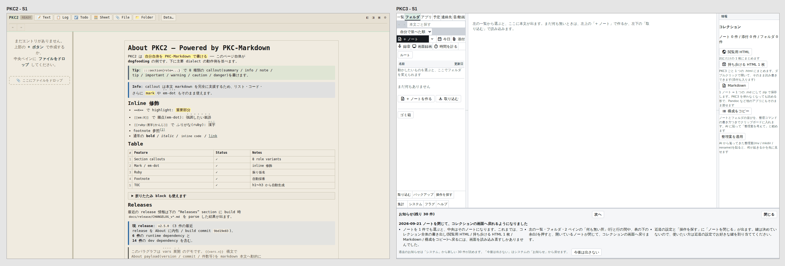 | **P7**:PKC3 は右の列に 4 ボタン + 各 3 行の説明が常設、PKC2 は何も選んでいないと右の列が無い。⚠ 画面全体の字は PKC2 のほうが多い(見本の文書)── 差は「操作のまわりの説明」だけ |
| 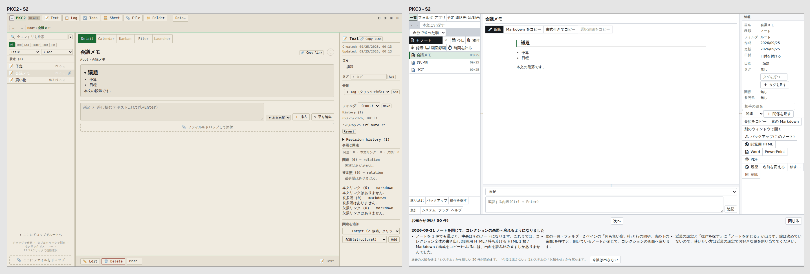 | **P3**:PKC2 は左上に「いま読んでいるだけ」を示す一言。**P1**:PKC2 は本文の下 1 本の列(Edit / Delete / More)、PKC3 は本文の上 4 個 + 右の列 16 個。**P2**:PKC3 の一覧は行に焦点が乗らない |
| 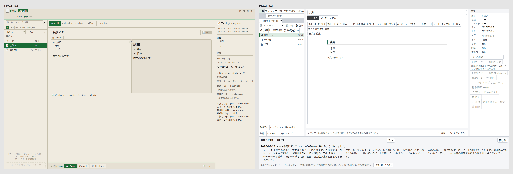 | **P3**:PKC2 は左上の一言が「編集中」に変わり + Format ▸ 1 個 + Save / Cancel。PKC3 は書式 21 個が 2 段 + 保存 / キャンセルが上下 2 組 + 「このノートは編集中です…」の注意文 + 右の列が薄い |
| 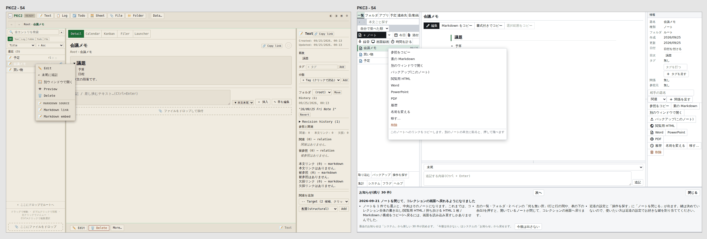 | **P1**:PKC2 は先頭が Edit / 末尾に追記、見出し付き 2 塊。PKC3 は 12 項目が区切り無しで「編集」が無い |
| 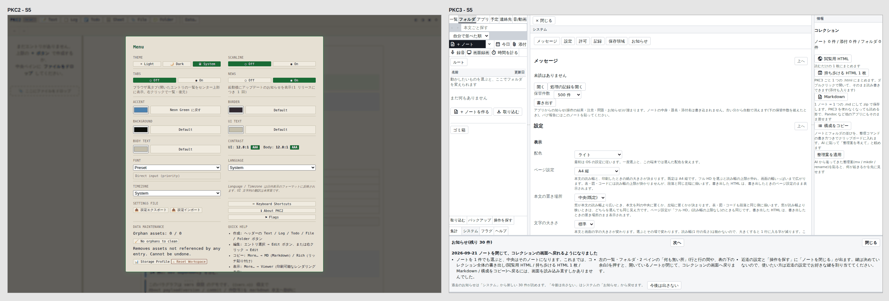 | **P7**:PKC2 は「見出し + 濃く出したボタンの列」の繰り返し。PKC3 は「プルダウン + 説明の段落」の繰り返しで画面の大半が文章 |
| 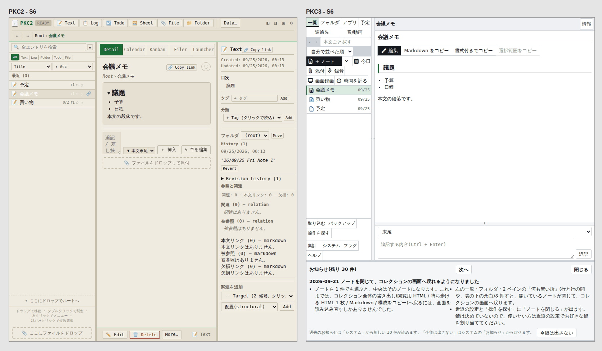 | **P6**:PKC3 は左の列のタブが 2 段、「+ ノート」の列が 3 段、下の列が 4 段(N3)。PKC2 は作成ボタンが最上段なので左の列の幅に影響されない |

## 3. 変える物 ── 原則ごと(本表の行 id 付き。見え方が変わる物は「いま → 案」を画面の言葉で)

| id | 行 | 原則 | いま → 案(画面の言葉) | 見え方 | 聞く | 渡し先 | 量と file |
|---|---|---|---|---|---|---|---|
| **C1** | G2 | P1 | 一覧のノートを右クリックしたメニューが、右の列と同じまとまり(ノートでは 5 つ、フォルダでは 6 つ)に**間**を空けて並び、**「編集」が入る**(推薦 = 「このノート」のまとまり(履歴 / 名前を変える / 移す…)の先頭。Q1 の A なら メニューの先頭。右に Ctrl+E、mac は ⌘E の字が薄く付く)。狭い幅の ⋯ にも同じ「編集」(添付 / 録音 / 画面録画 / 時間を計る の下 ── 裁定 2026-09-02 の順は崩さない)。右の列には「編集」を**足さない**(本文の上のボタンが持つ)。**本文がまだ届いていない間はメニューの「編集」を押せなくする**(上のボタンと同じ `disabled = !bodyReady` `detail.ts:1134` ── 無言の dead click を作らない)。⚠ 予定のカードの右クリックは「繰り返す…」が頭に足される(`binder.ts:11867-11888`)ので、そこでは「編集」は 2 番目 | 変わる | **Q1** | #582 §4 + #1029 手 3 を右クリックへ | S〜M:`entry-actions.ts`(先頭に 1 行 + 「右の列には出さない」を表す列 + action→command の対応を 1 か所へ ── `SHORTCUT_BUTTON` を逆引きするか `EntryAction` に command を持たせる)/ `binder.ts:11871-11888`(行のメニューにも `withShortcut` を通す)/ `context-menu.ts`(`MenuItem` に塊 ── 属性名は右の列と同じ `data-pkc-group` を再利用し 2 つ目の綴りを作らない)/ `app.css:561-598`(間 = `:1936-1946` と同じ `var(--s3)`)/ `binder.ts:9109`(`edit-entry` の押し先を `[data-pkc-field="detail-toolbar"]` に限る ── `:9128` と同じ作法)/ **落ちる test**:`tests/features/entry-actions.test.ts:607-613` / `tests/adapter/inspector-action-groups.test.ts:196-211, 250-258, 261-266`(右の列に出さない列を読む形へ)/ smoke `context-menu.smoke.spec.ts:36` に assert / 新 unit(本文到着前に押す → 断り) |
| **C2** | G1 | P2 | 一覧タブで行を押した後、↓ ↑ で隣の行へ移り Enter で開く。絞り込みの欄で ↓ を押すと 1 件目へ降りる。名前の打ち替えを Escape でやめると、その行に戻る。見た目はブラウザ既定の焦点の枠だけ | 枠だけ | 聞かない(§4)| **新規 issue A** | M:`sidebar.ts:277-279`(tabIndex の巡回 = `filer.ts:894, 929` と同型)・`:325-355`(やめたら行へ focus)/ `binder.ts:12176-12192` と同型を `entry-filter` に / `keymap.ts:44-51, 63-77, 298-310`(`filer` の文脈を一覧にも ── 見出しの字を直す)/ unit + smoke(既存の台) |
| **C3** | G3 | P2 | 何も編集していないとき Escape を押すと、開いているノートが閉じてコレクションの画面に戻る(メニュー / ダイアログ / 名前の打ち替え / 表のセル / 編集 が在れば、そちらが先に 1 段だけ閉じる。入力欄に文字カーソルが在るときは効かない)。予定表・連絡先の別ウィンドウは Escape で閉じる。付箋のウィンドウも Escape で閉じる(編集中なら先に編集をやめる)。近道の設定・ヘルプ・操作を探す の「どこで効くか」の見出しが 2 つ増える(「ノートを読んでいるとき」「別のウィンドウ」) | 押した結果 + 見出し 2 行 | **Q3** | 新規 issue A | M:`keymap.ts:44-51`(`global` でない文脈 2 つ)・`:63-77`(`CONTEXT_LABELS` 2 行)・`:152-175`(`deselect-entry` の contexts と `defaults: ['Escape']`)・`close-pane` を `KEY_COMMANDS` へ / `binder.ts:12231`(`'global'` しか match しない ── 新文脈の match を足す)・`:12240`(入力中の門はそのまま)・`:9092-9131`(`SHORTCUT_BUTTON` に `close-pane`)/ **付箋は `close-pane` の流用では閉じない**(`holding` が `heldViewWindow` だけ `main.ts:3033-3037`)── `heldNoteWindow` を見る別の閉じ道を足す / `keymap-panel.ts:134` / `palette-rows.ts:107-108` / `tests/features/keymap.test.ts:188-195`(`KEYLESS` から外す)/ `tests/adapter/keymap-binding.test.ts:733` / お知らせ 1 件(9/21 の物は書き換えない) |
| **C4** | G14a | P3 | 編集を始めると、画面下の 1 行(ステータスバー)の先頭に「**編集中**」と出る。他の知らせ(保存先の注意 / 複数タブ / 保存中)と同時のときは「編集中 — 保存先の注意 …」の順で並ぶ(先頭は常に状態)。読んでいるだけのときは今までどおり(保存先が通常で他の知らせが無ければ何も出ない)。追記欄の所の「このノートは編集中です。保存するか、キャンセルすると追記できます。」は「**編集中**」の 1 語 + 保存 / キャンセル になる。保存できずに止まったときの先頭語は**新しい字を作らず**、C11 で 1 つに寄せた断り文を引く。付箋のウィンドウも同じ(`main.ts` の `paint` は共通 = K16) | 変わる | **Q2** | #1017 §3.1 の追加段 | M:`main.ts:1340-1342`(先頭に状態の 1 語 ── 組む関数を取り出す)/ `append-box.ts:251-252` / `app.css:5689-5704` / `tests/adapter/action-labels.test.ts:130-134`(主張を書き直す)/ unit(取り出した関数)。**C11 の後に着地** |
| **C5** | G12 G13 G14b | P3 | 「コピーしました」のような知らせが画面下の 1 行に居座らず、メッセージへ入って「未読 N 件」が出る(読み上げにも乗る)。「保存できていない・閉じると消える」は他と違う見た目。書き出し中 / Office の一式の設置中 / SQL 実行中 は同じ場所に同じ形 | 変わる | 聞かない(裁定済み)| #1017 §3.1 / §7 の残作業(渡すだけ)| M:`main.ts`(`showStatus` 23 か所 → メッセージ、`:1648` の重大度)/ `shell.ts:870-958` / `role="status"` は src に 0 件。⚠ **doc と実装の食い違い**:`ui-total-design:102`「知らせの本文はここに出さない」に対し `main.ts:1420-1424` はいまも連結し「状態変化では消えない」。注記:PKC2 の知らせは 7 秒(`PKC2 toast.ts:56`)|
| **C6** | G10 G11 | P5 | 主のノートを編集している間も、横に留めた別ノートのチェック・表のセル・並べ替えが押せる。編集中のノート自身に押したときだけ「編集中は使えません(保存するか、キャンセルすると戻ります)」が画面下に出る(いまは無言 ── チェック / 表のセル / 表の形 / 表の書式 / 繰り返し / Todo の状態 の **5 種 7 case**) | 断りが出る | 聞かない(§4)| **新規 issue B** | M:`app-state.ts` の 7 case(`:5563 / 5590 / 5619 / 5638 / 5662 / 5686 / 5944`)+ `bodyRewriteGate` `:7907`(lid で判定する門へ)/ reducer unit(別 lid は通る・同 lid は止まる)。🔴 **書込の門を触るので変異試験を必ず当てる**(「lid を見ない」に戻して落ちることを見る)。**C11 の後に着地** |
| **C9** | G6 | P6 | 2 ペインで行を右クリックしても、中央がそのノートに切り替わらず、2 ペインに居たままメニューが出る | 直るだけ | 聞かない | 修理 | S:`binder.ts:11615` の前に `dual-row` の早期分岐(`:4754-4759` と同型。`ASIDE_PANES` は触らない)/ `dual-filer.smoke.spec.ts` に assert 1 つ。🔴 **先に実ブラウザで再現**(静的読み)── 再現しなければ落とす |
| **C10** | G17 | P6 | フォルダ表・2 ペインで下まで見て別の画面から戻ると、同じ所から続きが見える(いまは先頭へ戻る) | 直るだけ | 聞かない | 修理 | S〜M:`filer.ts` / `dual-filer.ts` に `ScrollMemory` / import 一覧(いまは 3 file)の等値 pin |
| **C11** | G4 | P4 | 右の列の押せないボタンに乗せたときの字が「編集中は使えません(保存するか、キャンセルすると戻ります)」になる(列の上の 1 行と同じ字)。集計などを開けないときの断りも同じ字。断り文 3 系統(`app-state.ts:707 / 717 / 4326`)を 1 か所へ寄せ、保存に失敗して止まったときの字もそこで 1 つに決める。マニュアルの同じ 1 行も追随 | 字(既に見えている字へ)| 聞かない(§4)| 修理 S | S:`inspector.ts:194` → `blockedActionNote` / `app-state.ts:4326` / `docs/manual.md:5193` / `tests/adapter/inspector-editing-locks.test.ts:160-170` の注釈。**C4 / C6 より先** |
| **C12** | G15 G18 G5 | P4 | ①「読み込んでいます…」「マニュアルを読み込んでいます…」「本文を読み込んでいます…」の 3 綴りが「読み込んでいます…」の 1 綴りに(出る場所がその対象の中なので対象は要らない。「集めています…」は全ノートを走査する別の操作なので残す)②一覧が空のときのボタンが「+ ノート」に(左上と同じ。中央の案内文は既にそう)③鍵の一覧・ヘルプ・操作を探す・マニュアルの「編集を確定する / 編集をやめる」が「保存 / キャンセル」に(どこで効くかの見出しは残る)④2 ペインの下の列「名前 / ゴミ箱」が「名前を変える / 削除」に(順は F キー順のまま。「移す」は別の操作なので触らない。⚠ 「削除」は右クリックでは 1 件、2 ペインでは選んだ全部に効く ── 行き先は同じゴミ箱で確認文が件数を言うので字は揃えてよいが、その差は注記に残す) | 字 | **Q4** | #1017 §6.1 規則 5 / #582 §4 段②-2 | S:①5 か所 / `empty-start.ts:37` / `keymap.ts:737-749` / `dual-filer.ts:191, 219` / `docs/manual.md:6262-6263` / tests(action-labels の動的走査・docs-parity)。スマホ幅は 4 列 1 マス ≒ 94px(`dual-filer.ts:172-173`)なので字切れを測る |
| **C13** | G16 | P2 | 一覧タブでも Ctrl+クリックで選び足し、Shift+クリックで範囲を選べる。選んだ行の背景が少し濃くなる(フォルダの表で複数の行を選んだときと同じ見え方 `app.css:6358-6360`)。**選び足している間、中央にはいま開いているノートが表示され続ける**(選び足しただけでは切り替わらない)。右クリックの「移す…」は選んだ全部に効く(`entry-actions.ts:288`)。「削除」は右クリックした 1 件(今のフォルダ表と同じ `binder.ts:5029-5073`) | 変わる | **Q6** | #582 §4(scope=selection)| M:`sidebar.ts`(背景)/ `binder.ts:9565-9573`(`inFiler` の門を一覧へ)/ `app-state.ts`(Shift の範囲を一覧の表示順で)/ tests + smoke |
| **C14** | N2 | P2 | 一覧・フォルダ表・2 ペインの行でノートを 2 回続けて押すと、別のウィンドウ(付箋)で開く(2 回押しの判定は 1 か所 `binder.ts:11455-11457` なので 3 つとも同じ)。フォルダの 2 回押しは今までどおり「入る」 | 押した結果 | **Q5** | 新規 issue A | S:`binder.ts:11442-11454`(フォルダ以外 → `open-note-window` の受け手を同じ lid で撃つ)/ unit + smoke assert 1 つ |
| **C15** | N1 | P1 | ▼ で選んだ種類(ログ / 表 …)が、次に起動しても「+ ログ」のまま残る(いまは起動ごとに「+ ノート」へ戻る)。分割ボタンの形は動かさない | 変わらない | 聞かない | 修理 | S:`shell.ts:469-497`(初期値)/ `binder.ts:7885-7890`(選んだら書く)/ `src/features/settings/settings-file.ts:120` の `SKIPPED_KEYS` に `why` 付きで 1 鍵(保持先は「記録」の型なので持ち出さない。`PORTABLE_KEYS` `:38` に置くと「設定の持ち出し」の対象になる ── `system-sections.test.ts:104` は control の無い鍵を `continue` で飛ばすので門は鳴らないが、型が違う)|
| **C16** | N4 (N3) | P6 | 窓を 1100px から少し広げたとき、左の列が縮んで「+ ノート」の列が 3 段に折れる(段 0 の値では 1101〜1248px)のが起きなくなる。案:1101px 以上の左の列の下限を境目の下側と同じ幅にする(本文が最大 42px 狭くなる。user の 1366px では変わらない)。N3(800〜1366 の折り返し)は #582 §2.3「本文が先に取る」の実装で | 幅 | 聞かない(広げて悪化する欠陥の修理)| 修理 S(N4)/ #582 §2(N3)| S:`app.css:135-137` / `:6150-6154` + CSS 構文 test。🔴 **本物の build で測ってから**(段 0 は静的複製)── 再現しなければ落とす |
| **C18** | H1 H2 | P7 | 「システム」の中で、選択肢が 4 つ以下の 10 項目(設定の節 8 / 許可の節 1 / メッセージの節 1)がプルダウンではなく「選ばれている物が濃く表示されるボタンの列」になる(一覧の種類で絞るボタンと同じ形)。配色 / ページ設定 / 貼り付け元 はプルダウンのまま。選択肢は 1 つも変わらない。各項目の下の説明(24 段落)が 1 行になるのは #1017 §6.1 規則 3 の適用(§4) | 大きく変わる | **Q7**(形だけ)| #1017 §3.2 の追加段 | M:`settings.ts`(select 13 のうち 10 / p 27)/ 切替列の描き手 1 つ(`kind-bar.ts:127-145` の形を共通化)/ `app.css` / `tests/adapter/system-sections.test.ts` / 新 test(4 つ以下は select で描かない・説明は 1 行)|

### 3.1 見本(実物の PKC3 に CSS / DOM を注入して撮る。作り方は mockups の仕様)

| 見本 | どの案 |
|---|---|
|  | C1 / Q1 の C(推薦):「このノート」のまとまりの先頭に「編集」+ Ctrl+E、まとまりの間が空く |
| 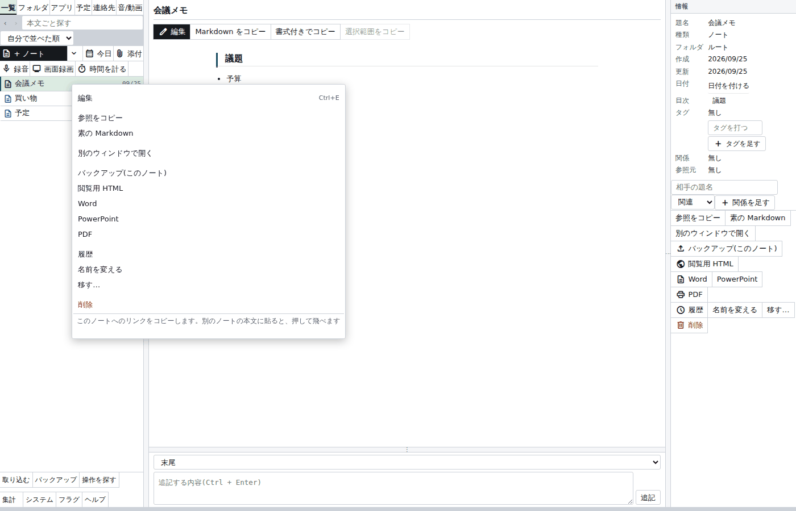 | C1 / Q1 の A:メニューの先頭に「編集」(2026-09-04 の裁定を覆す形) |
| 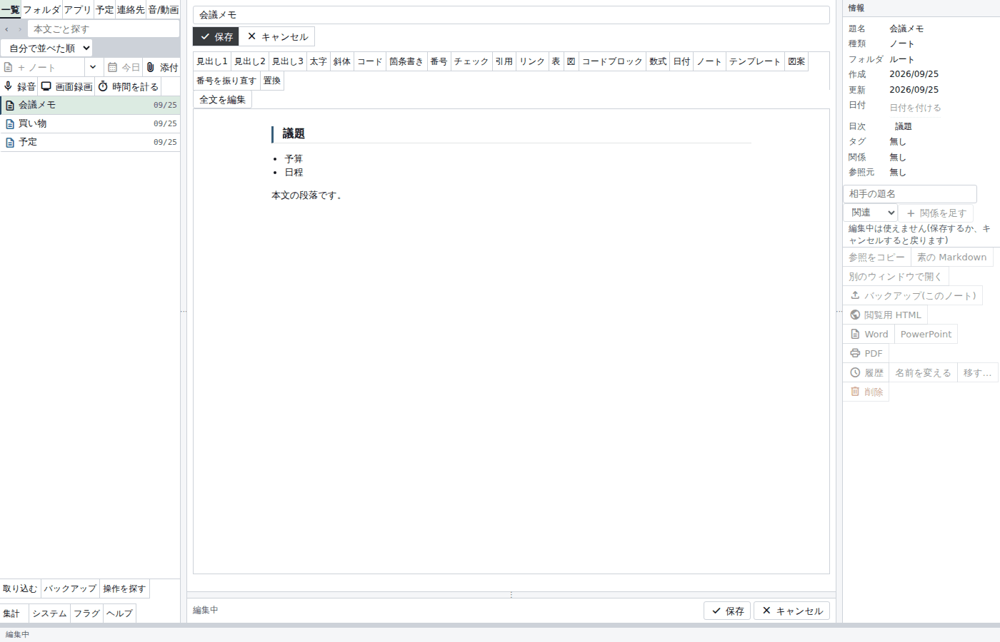 | C4 / Q2:画面下に「編集中」、追記欄の文が 1 語に |
| 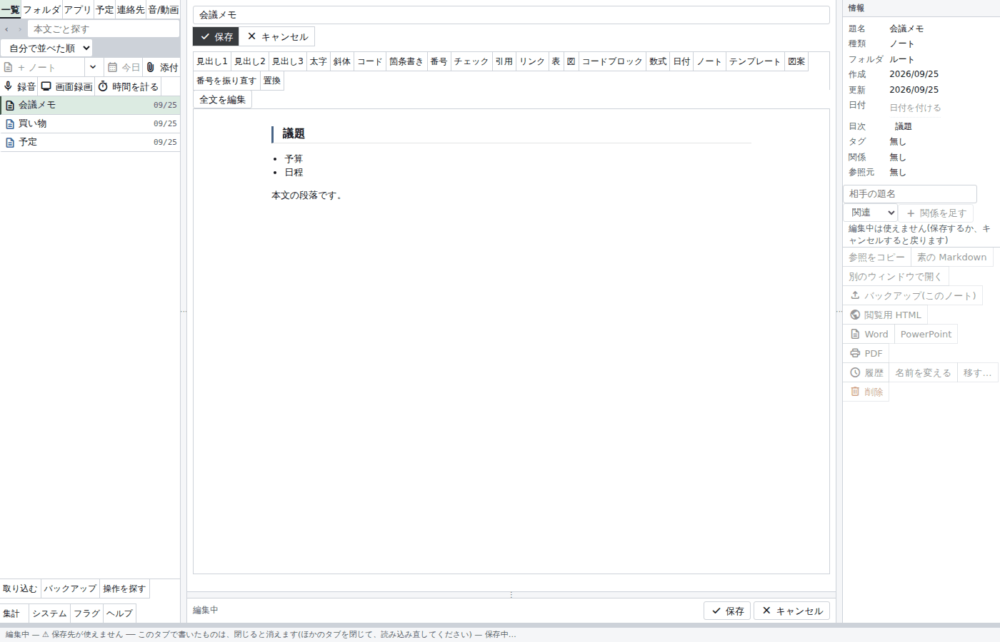 | C4 / Q2:「編集中」と保存先の注意が同じ 1 行に並んだとき |
| 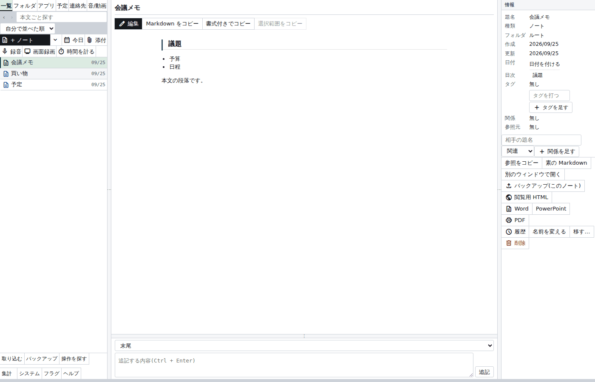 | C13 / Q6:一覧タブで 2 件を選び足し、中央は元のノートのまま |
| 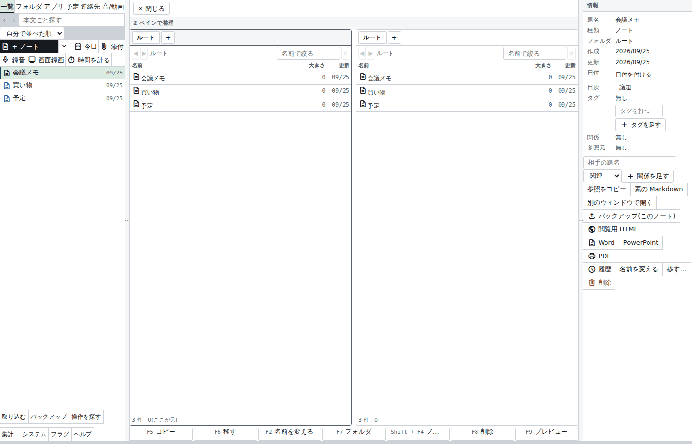 | C12 ④ / Q4:「名前を変える / 削除」 |
| 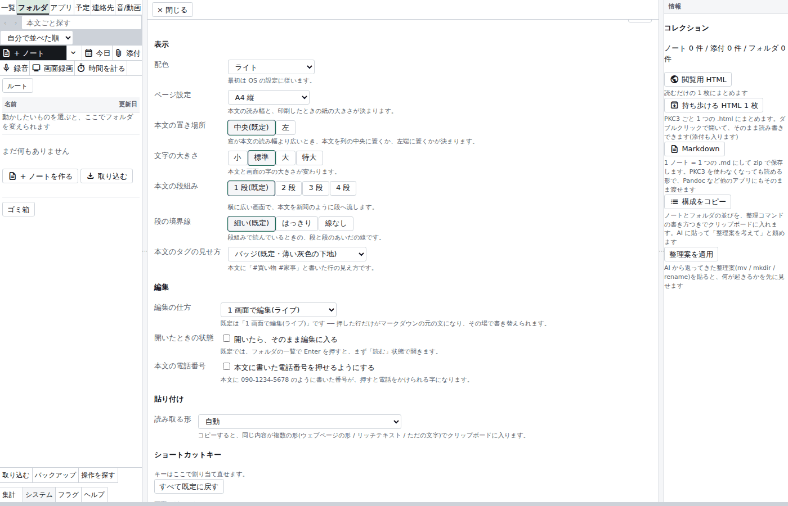 | C18 / Q7:切替ボタンの列 + 説明 1 行 |

### 3.2 まだ設計していない物(⛔ 未設計・後日提示 ── 上の表とは別。ここでは聞かない)

| id | 行 | 原則 | 方向(決まっているのは #582 §3.3「採る」だけ) | 次にやること |
|---|---|---|---|---|
| **C7** | G7 | P5 | 見出しの右クリック「ここから編集する」が、その章だけを欄で開き、その間も他のノートや横の枠は触れる ── **どう見えるかは未設計** | 設計 doc 1 本(issue C)。「1 画面の行の欄が phase を取らずに書けるか」の実測から。⚠ 合成 lid は採らない。量 L:`app-state.ts` / `binder.ts:2303` / `detail.ts` / `row-swap.ts` |
| **C8** | G8 G9 | P5 | 見出しの右クリックの末尾に「この章を別のウィンドウで開く」/ コード枠のその場編集 ── **同上** | C7 の doc に同梱して画面の言葉で 1 度で見せる。量 M + M:`entry-actions.ts:690-706` / `view-window.ts` + `entry:<lid>#h/<id>`(#579)/ code fence の書換 1 種 |

### 3.3 記録だけ(実装へ回さない ── C17)

| id | 行 | 何を記録するか | 手 1(取り下げ済み)と何が違うか |
|---|---|---|---|
| **C17** | G20 G21 G23 G24 K10 K12 | 左下・作る列の幅の段 / 32px の例外 3 件と `button:active` の色 / 押せない濃さ 3 値 / マニュアルの別ウィンドウの目次の行の高さ(計算値・未実測) | **違わない** ── どれも**こちらが測って見つけた物で、user の困りごとではない**(user の 2026-09-21 の指摘「横のサイズがでこぼこ」は右の列の話で、#1029 段 C で対応済み)。だから #1029 §1.5 の例外の表に記録するだけにし、user が「左下もでこぼこ」と言ったときに出す(§9) |

## 4. 聞かずに決まる物(推薦で進める。なぜ聞かないか 1 行)

| 何 | なぜ聞かないか |
|---|---|
| C2 一覧を矢印で辿る | user 指示 2026-08-18「デフォルトは PKC2 の操作感に寄せる」(`keymap.ts:1-5`)。フォルダ表・2 ペインが既に持つ動きを一覧にも効かせるだけで、字も部品も増えない(焦点の枠はブラウザ既定)。お知らせに載せる |
| C5 知らせをステータスバーから外す・重大度・進行中 | 裁定 2026-09-20「ステータスバーをメッセージの置き場に使うな」/ #1017 §3.1・§7 の残作業 ── 台帳③は明細を渡すだけ |
| C6 編集中に横の枠を止めない + 無言 5 種 7 case に既存の断り文 | 押しても何も起きないのは欠陥(無言の dead click)。出す字は既に右の列の上に見えている `EDITING_NOTE` ── 新しい字は 0。⚠ ただし書込の門なので変異試験を必ず当てる |
| C7 / C8 章だけ編集・章の別ウィンドウ・コード枠 | #582 §3.3(`operation-model:397-406`)が「採る」と裁定済み。無いのは設計 ── 設計 doc 1 本を書いてから、画面の言葉で 1 度で見せる(§3.2) |
| C9 2 ペインの右クリック / C10 スクロール位置 | 欠陥の修理(user 指示 2026-08-03「スクロールが発生するすべての画面が対象」)。C9 は先に再現を取る |
| C11 乗せたときの字・断り文の一本化 | 変わる字は同じ列の上に既に見えている `EDITING_NOTE`。3 系統を 1 か所へ寄せるのは #1017 §6.1 規則 5 の適用 |
| C15 選んだ種類を覚える | user 指示 2026-08-05 の形は動かさず、選択を覚えるだけ。保持先は「記録」型(`SKIPPED_KEYS`)なので見える概念は増えない |
| C16 幅の境目(N4) | 「広げたら悪化する」は思想①に反する欠陥の修理。user の 1366px では変わらない。本物の build で測ってから |
| C18 の説明 1 行 | #1017 §6.1 規則 3「動詞句をボタン名にしない。説明は下の 1 行と確認の窓へ」(`ui-total-design:224`)の適用。残りは乗せたときの字とマニュアルへ。聞くのは部品の形(Q7)だけ |
| C19 「Todo」の字 | 標準語の一覧(`ui-terms.ts:60`)に載せるだけで**画面の字は変えない**。こちらが測って見つけた物で user の困りごとではない(候補「やること」は `schedule.ts` / `tile-icons.ts` で別の意味に使われており衝突 ── 段 0 の指摘、私は未検証) |

### 4.1 「見せる」だけの物(聞かない ── 上の表の見え方の 1 行)

C6 の断り文が出る場面(いまは無言)、C11 の乗せたときの字、C16 の左の列の幅(1101〜1248px の帯域だけ)、C18 の説明 1 行 ── 裁定 2026-08-28 に従い、ここで 1 度見せた(§3 の「いま → 案」と見本 M5)。

### 4.2 触らない物(理由つき)

- **書式のボタン 21 個・2 段** ── user 要望 2026-08-03「書式設定系のパネルも必要」(`format-bar.ts:4`)。畳める列にする案(掴む帯 / 鍵 / 操作を探す の 3 つ揃い = #582 §4.3)は、user が「編集中の部品が多い」と言ったときに出す(§9)。減らすのは「状態を示すために足された部品」(C4)だけ。
- **読むときの 3 つのコピー** ── user 裁定 2026-08-08(`detail.ts:1103-1104`)。
- **追記欄の 2 組目の 保存 / キャンセル** ── 減らさない。#582 §4.4「減らすのは登記の数であって押せる場所ではない」(`operation-model:542-547`)/ `tests/adapter/action-labels.test.ts:113`「出口が 2 つ在ることは #655 ④ の約束」。長いノートで下まで打っているとき上のボタンが画面に残るかも未実測。Q2 の B は user が選んだときだけ。
- **分割ボタン「+ ノート」+ ▼ / フォルダの 2 回押し / 右の列の絵無し・見出し無し / 操作を探す / システムの節と目次 / 知らせはメッセージへ / 右の列の塊を間で区切る** ── 裁定済み。
- **「読んでいるとき何も選んでいないと右の列を描かない」(PKC2)** ── #1017 段④で右の列にコレクションの操作を出すと裁定済み。逆向きの提案はしない。
- **右クリックの「追記」** ── PKC2 の「末尾に追記」は「選んで追記欄へ焦点」の近道(`PKC2 action-binder.ts:4162-4176`)。PKC3 は右クリックで行を選ぶと同じ追記欄が下に出る(K21)ので、足すのは焦点の 1 手だけ ── 同じ仕事の押す場所を 2 つ作らない(CLAUDE.md §7)。Q1 の選択肢 B に残す。
- **「Todo」の字**(C19)── 上の表。

## 5. user に聞くこと(委任の外だけ。1 問 1 テーマ。数は末尾の注記)

### Q1 一覧のノートを右クリックしたメニューの、どこに「編集」を置きますか

- **画面で何が起きるか**:いまは 12 項目が区切り無しに並び、「編集」がありません(ノート全体の「編集」は本文の上のボタンと Ctrl+E。見出しからは右クリック / Ctrl+クリックで途中から入れます。見比べ S4 の右)。案は、項目が右の列と同じまとまり(ノートでは 5 つ、フォルダでは 6 つ)ごとに少し間を空けて並び、「編集」が入って右に Ctrl+E(mac は ⌘E)の字が薄く付きます。項目は 1 つも減りません。本文がまだ読み込まれていない一瞬は「編集」が押せない表示になります(上のボタンと同じ)。
- **選択肢**:**A** メニューの先頭に「編集」+ 間(写す 2 つを含む全項目が 1 つ下へずれる ── 2026-09-04 の裁定を覆す提案。見本 1b)/ **B** A に加えて「追記」(行を選んで下の追記欄に文字カーソルを入れる近道)も先頭 2 番目に / **C** 「このノート」のまとまり(履歴 / 名前を変える / 移す…)の先頭に「編集」+ 間(写す・開く・書き出すの並びは動かない。見本 1)/ **D** 間だけ空ける(「編集」は足さない)/ **E** いまのまま
- **推薦**:**C**
- **理由**:段 0 で見つけた欠け 2 つ(右クリックに「編集」が無い / まとまりが無い)を、2026-09-04 の裁定「新しい操作のために、毎日使う項目を 1 つ下へずらさない」(`entry-actions.ts:174-178, 283-285`)を守ったまま両方埋める形です。「編集」はこのノートに対する操作なので、「このノート」のまとまりに入るのが型の上でも自然です。PKC2 は先頭に「Edit」を置いていましたが(証拠)、先頭に置くと写す 2 つを含む全項目が 1 つ下へずれます ── それは 09-04 に止めていただいた形そのものなので、先頭が欲しい場合は A を選んでください(**覆す提案**)。B にしないのは、追記欄は行を選べば下に出ていて、足すのは焦点の 1 手だけだからです(§4.2)。まとまりの間は #1029 段 B で決めた形を同じ表から出すだけです。
- 注記:予定のカードの右クリックは「繰り返す…」が頭に付きます(A でも「編集」は 2 番目)。

### Q2 「編集中」と分かる場所を 1 つにしてよいですか

- **画面で何が起きるか**:編集を始めると、画面下の 1 行(ステータスバー)の先頭に「編集中」と出ます。保存先の注意や「保存中」など他の知らせが同時に在るときは「編集中 — 保存先の注意 …」の順で同じ 1 行に並びます(見本 3)。追記欄の所の文「このノートは編集中です。保存するか、キャンセルすると追記できます。」は「編集中」の 1 語になり、隣の 保存 / キャンセル はそのままです(見本 2)。読んでいるだけのときは今までどおり(保存先が通常で他の知らせが無ければ何も出ません)。保存できずに止まったときの先頭語は、右の列の押せない理由と同じ字を引きます(新しい字は作りません)。
- **選択肢**:**A** 画面下に「編集中」+ 追記欄は 1 語 + 保存 / キャンセル / **B** A に加えて、追記欄の 2 組目の 保存 / キャンセル と文を無くす(出口は上のボタンだけ)/ **C** いまのまま(状態は言わず、ボタンや追記欄の形の変化で示す)
- **推薦**:**A**
- **理由**:PKC2 は画面の左上に、いま読んでいるだけか編集しているかを常に一言で示し(S2 / S3)、そのうえで部品を減らしていました。PKC3 は言わずに部品を足して示しています ── user 指示 2026-08-15「中央の上を潰しすぎ / ボタンがボタンすぎる」と同じ根です。B にしないのは、長いノートで下まで打っているときに保存の押す場所が手元から消えるから(上のボタンが画面に貼り付くかは未実測 ── 貼り付くなら B へ倒せます)。覆す物はありません(#1017 §3.1「ステータスバー = いま起きていること」の中)。
- 注記:保存先が通常で他の知らせが無いときは画面下の 1 行が畳まれているので、そのときだけ編集中に 20px の行が現れて本文の高さがそのぶん動きます。

### Q3 何も編集していないときに Escape で開いているノートを閉じてよいですか(別ウィンドウも Escape で閉じる)

- **画面で何が起きるか**:読んでいるだけのときに Escape を押すと、開いているノートが閉じてコレクションの画面に戻ります(いまは何も起きません)。右クリックのメニュー・ダイアログ・名前の打ち替え・表のセル・編集 が在るときは、今までどおりそちらが先に 1 段だけ閉じます。入力欄に文字カーソルが在るときは効きません。予定表・連絡先の別ウィンドウは Escape でそのウィンドウが閉じます(いまは × か Ctrl+W)。付箋のウィンドウも Escape で閉じます(編集中なら先に編集をやめます)。近道の設定・ヘルプ・操作を探す の「どこで効くか」の見出しに「ノートを読んでいるとき」「別のウィンドウ」の 2 行が増えます。
- **選択肢**:**A** 全部入れる / **B** 別ウィンドウ(予定表・連絡先・付箋)の Escape だけ入れる(ノートを閉じる鍵は user が割り当てるまま)/ **C** 入れない
- **推薦**:**A**
- **理由**:鍵で開けた物が鍵で閉じられないのは片道の操作(思想④)で、PKC2 は Escape が必ず 1 段閉じました(`PKC2 action-binder.ts:6263-6271`)。⚠ 2026-09-21 のお知らせ(`notice-log.ts:170`)で「鍵は決めていないので、お好きな鍵を割り当ててください」と配ったばかりなので、変えるならここで伺います ── **その形を覆す提案です**。ただし覆すのは実装側の判断です:keymap の検算に断られて「既定の鍵を置かない」形にしたもので、user 裁定ではありません(出どころ `CLAUDE.md:707` の表 / `session-handoff-2026-09-24.md:72`、どちらも「全て推奨で OK」の委任の内側)。検算(`contextsOverlap`)は緩めず、「読んでいるときだけ効く」文脈を足す形で通します。新しいお知らせを 1 件出します(配ったお知らせは書き換えません)。
- 注記:付箋のウィンドウは予定表・連絡先と閉じ方の仕組みが別なので、同じ issue の中で段を分けます。

### Q4 同じ操作の字を 4 か所で揃えてよいですか

- **画面で何が起きるか**:①待っている間の「読み込んでいます…」「マニュアルを読み込んでいます…」「本文を読み込んでいます…」の 3 綴りが「読み込んでいます…」の 1 綴りになります(出る場所がその対象の中なので、対象は付けなくても分かります。「集めています…」は全ノートを走査する別の操作なので残します)②一覧が空のときのボタン「+ ノートを作る」が左上と同じ「+ ノート」になります(中央の案内文は既に「+ ノート」)③鍵の一覧・ヘルプ・操作を探す・マニュアルの「編集を確定する / 編集をやめる」が、ボタンと同じ「保存 / キャンセル」になります(どこで効くかの見出しは残ります)④2 ペインの下の列の「名前 / ゴミ箱」が、右クリックと同じ「名前を変える / 削除」になります(並びは F5〜F8 の順のまま。「移す」は別の操作なので触りません。見本 5)。
- **選択肢**:**A** 4 件とも / **B** 番号で指定(別の字にしたい物は字を書いてください)/ **C** 変えない
- **推薦**:**A**
- **理由**:ボタンの字が正本で、他の場所はそこから引く(#582 §4 / #1017 §6.1 規則 5)。実装自身が「どのボタンの字とも一致しない」と書いています(`app-state.ts:714-715`)。③は grep 済みで衝突なし(「保存」を label に持つ命令は「.csv で保存」だけ / 操作を探すは「どこで効くか」を添えるので裸で並びません)。④の「削除」はゴミ箱へ移す操作で、確認文が両方「ゴミ箱から戻せます」と言っています。覆す物はありません(④は #1029 段 C で「名前を変える → 名前」と短くする側を取り下げた向きと同じ)。
- 注記:①は 5 か所(素の 2 / マニュアルを 2 / 本文を 1)。「集めています…」は 4 か所。④はスマホ幅で 4 列 1 マス ≒ 94px なので、入れる前に字が切れないことを測ります。また「削除」は右クリックでは押した 1 件、2 ペインの F8 では選んだ全部に効きます(今と同じ ── 確認文に件数が出ます)。

### Q5 一覧・フォルダ表・2 ペインの行でノートを 2 回続けて押すと、別のウィンドウ(付箋)で開いてよいですか

- **画面で何が起きるか**:1 回目で中央にそのノートが出るのは今のまま。2 回目でそのノートが別のウィンドウ(付箋)で開きます。2 回押しの判定は 1 か所なので、一覧・フォルダ表・2 ペインの行の 3 つとも同じになります。フォルダの 2 回押しは今までどおり「入る」です。右クリック / 右の列の「別のウィンドウで開く」はそのまま残ります。
- **選択肢**:**A** 入れる / **B** 入れない
- **推薦**:**A**
- **理由**:マウスだけで別ウィンドウに 2 手かかるのを 1 動作に(思想③「アプリの基本は別窓 / マウスで完結」)。PKC2 は flag 無しで全種類がそう(`PKC2 action-binder.ts:9271-9281`)で、利用者の感想 2026-09-04「マルチで付箋開けるといいかもね」(`entry-actions.ts:168-172`)も同じ向きですが、**2 回押しはマウスの癖(好み)なので伺います**。フォルダの裁定(2026-08-17)は覆しません。

### Q6 一覧タブでも Ctrl / Shift で選び足せるようにし、選んだ行の背景を少し濃くしてよいですか

- **画面で何が起きるか**:一覧タブで Ctrl+クリックすると行が選び足され、Shift+クリックで範囲が選べます。選んだ行の背景が少し濃くなります(フォルダの表で複数の行を選んだときと同じ見え方。見本 4)。選び足している間、中央にはいま開いているノートが表示され続けます(選び足しただけでは切り替わりません)。右クリックの「移す…」は選んだ全部に効きます。「削除」は右クリックした 1 件です(今のフォルダ表と同じ)。
- **選択肢**:**A** 入れる / **B** 入れない
- **推薦**:**A**
- **理由**:PKC3 の中でフォルダ表と 2 ペインは選び足せて、一覧タブだけ例外(思想③「同じ物が常に同じ場所」)。入れない理由 3 つ(`binder.ts:9565-9573`)のうち「一覧タブは選んだ行を描き分けないので押しても見えない」が本体なので、描き分ける = 見え方が変わる、として伺います。覆す物はありません。

### Q7 「システム」の設定のプルダウンを、PKC2 と同じボタンの列にしてよいですか

- **画面で何が起きるか**:選択肢が 4 つ以下の 10 項目(設定の節の 本文の置き場所 / 文字の大きさ / 段組み / 段の境界線 / タグの見せ方 / 編集の仕方 / 書庫を開く場所 / アプリの開き方、許可の節の 外部の画像、メッセージの節の 保管件数)が、プルダウンではなく「選ばれている物が濃く表示されるボタンの列」になります(一覧の種類で絞るボタンと同じ形。見本 6)。配色 / ページ設定 / 貼り付け元 はプルダウンのままです。選択肢は 1 つも変わりません。各項目の下の説明が 1 行になるのは既に決まっている規則の適用なので、ここでは聞きません(見本 6 に一緒に写っています)。
- **選択肢**:**A** ボタンの列にする / **B** プルダウンのまま
- **推薦**:**A**
- **理由**:見比べ S5 で PKC2 は「見出し + 濃く出したボタンの列」だけ、PKC3 は画面の大半が文章です。同じ用途のボタンの列を PKC3 は他の画面で既に使っていて(9 file)、設定だけ形が違います(思想③)。新規作成のボタンは、user の「プルダウン式の新規作成ボタンは使いにくい」(2026-08-05 `shell.ts:454-457`)で分割ボタンに変えた前例があります(⚠ 2026-08-29 の「移動先のプルダウンは邪魔」は置き場所の話なので、根拠に数えません)。覆す物はありません(#1017 §3.2 は節の分け方を決め、部品の形は決めていません)。
- 注記:「システム」全体のプルダウン 13 のうち 10 が対象(設定 8 / 許可 1 / メッセージ 1)。説明の段落は 24。「操作のまわりの説明が PKC2 90 字 / PKC3 420 字」はソースの文字列を数えた値で、描かれた画面ではありません(§9)。

## 6. 既存トラックへ渡す物と、新しく切る issue(4 本目のトラックは作らない)

| 渡し先 | 何を |
|---|---|
| **#582** | C1(§4:操作の表から右クリックにも出す ── 手で項目を足さない)/ C12 ③(段②-2:label = 字の正本)/ C13(§4 scope=selection を一覧タブにも)/ C16 の N3(§2.3 本文が先に取る)/ C7 の設計(§3.3) |
| **#1017** | C4(§3.1 追加段:状態の 1 語)/ C5(§3.1 / §7 の残作業:`showStatus` 23 か所のうちメッセージへ流れていない分・読み上げ・重大度)/ C11・C19(§6.1 規則 5 / §6.2 標準語)/ C12 ①②④(§6.1 規則 5)/ C18(§3.2 追加段:設定の部品の形 + §6.1 規則 3 の説明 1 行。⚠ 右の列(何も選んでいないとき)の 5 ボタン下の 3 行の説明も同じ規則の候補 ── §5 の裁定「バックアップの中身が分かる 1 行」は残す) |
| **#1029** | C1 の間(手 3 を右クリックへ)/ C17 の記録(§1.5 例外の表に 32px 系 3 件・`button:active` の色 K12・押せない濃さ 3 値・左下の幅の段) |

新しく切る issue(#1038 の子。トラックにしない):

| issue | 題 | 中身 3 行 |
|---|---|---|
| **A** | 一覧をキーボードとマウスの近道で辿る(C2 / C3 / C14) | ①一覧タブに矢印・Enter・絞り込みからの降下・打ち替え後の焦点の戻し ②Escape で 1 段閉じる + 別ウィンドウも Escape(`global` でない文脈 2 つ、検算は緩めない。付箋は閉じ道が別なので段を分ける)③ノートの 2 回押しで別ウィンドウ。関連 #1032 / #257 / #240 / #332 ── #257 が「#240 と一緒に」と先送りし #240 が受け取らなかった 2 度目の未着手であることを書く |
| **B** | 編集中でも、開かずに済ませる道を止めない(C6) | ①`TOGGLE_TASK` ほか 7 case と `bodyRewriteGate` を lid で判定する門へ ②同じ lid のときは既存の `EDITING_NOTE` で断る(無言 0 件を全数 pin)③書込の門なので変異試験を必ず当てる |
| **C** | 章だけ編集・章の別ウィンドウ・コード枠のその場編集の設計(C7 / C8) | ①まず「1 画面の行の欄が phase を取らずに書けるか」を実測 ②phase を変えない章の状態を設計(合成 lid は採らない)③設計 doc 1 本を画面の言葉で 1 度で見せる。#582 §3.3 の設計として起票 |
| **D** | 修理の束(C9 / C10 / C11 / C15 / C16 N4 / C17 の記録) | ①C9 は先に実ブラウザで再現 ②C16 は本物の build で測ってから ③1 PR 1 件で単独に着地、お知らせ 1 行。C11 は C4 / C6 より先 |

## 7. 退行させない物(K1〜K28 の要約と、当て方)

- **字と塊の正本は 1 か所**(K1 / K2)── C1 は手で複製しない。`ENTRY_MENU_ACTIONS` に 1 行足すだけで右の列・⋯・右クリックが同時に揃う。直書き 1 件「コピーした物」(`binder.ts:4192-4195` ── 段 0)は #582 C1 の対象。
- **マニュアルとの突き合わせ**(K3)── 字を変える PR は `docs-parity` を同 PR で。
- **ダイアログの焦点と直列**(K14 / K18 / K19)── C3 の Escape の順は メニュー → ダイアログ → 打ち替え / 表のセル / SQL 欄(いまの 6 つの受け手)→ 編集 → ノート → 別ウィンドウ。「複数選択を外す」は今の PKC3 に無い動きなので順に入れない(C13 で足すなら別に見せる)。ダイアログは native `<dialog>` が先に受けるので触らない。
- **別ウィンドウが本体と同じコード**(K8 / K11 / K16 / K20)── C4 は `main.ts` の `paint` 1 本なので付箋にも同時に届く。別ウィンドウに独自 CSS を持ち込まない(G24 の修理はその逆向き)。
- **追記欄の位置と字が種類によらず同じ**(K21)/ 追記の 1 手戻し(K22)── C4 は追記欄の文を短くするだけで欄も出口も減らさない。
- **開かずに済ませる道**(K23〜K27)── C6 は K27 を編集中まで広げる。C7 は表のセルと同じ「phase が ready のまま body が変わる」不変量を持つ。
- **まとめて削除の後の選択の規則**(K17)── C13 はその規則をそのまま一覧タブへ。
- **押せない物を黙って出さない**(K13 の隣)── C6 の無言 7 case を断りに変える。C1 の「編集」は本文が届くまで押せない表示にする。

## 8. 段取り(各段が単独で着地。裁定を待つ段だけ印)

| 段 | 何を | 裁定 | 量 | 着地条件 |
|---|---|---|---|---|
| **A** 修理の束 | **C11(断り文を 1 か所へ)を最初に** → C9(先に再現)/ C10 / C15 / C17 の記録 → issue D | 不要 | S〜M | 1 PR 1 件。お知らせ 1 行。C11 が入るまで C4 / C6 に着手しない(断り文が一時的に 4 系統にならないため) |
| **B** キーボードの床 | C2 → issue A | 不要 | M | keymap の検算を緩めない / smoke は既存の台に assert |
| **C** 右クリック | C1(+ ⋯ + 予定のカードの順 + 本文到着前の押せない表示)| **Q1** | S〜M | 落ちる test 4 本を先に書き直す / `edit-entry` の押し先を本文の上のボタンに限る / 行のメニューにも `withShortcut` |
| **D** 状態を 1 語で | C4(A の C11 の後)、続けて C5 を #1017 の残作業として | **Q2** | M | 付箋のウィンドウでも同じ表示になることを parity で見る / `action-labels.test.ts:130-134` を書き直す |
| **E** 字の束 | C12 | **Q4** | S | action-labels の動的走査と docs-parity の門を**先に広げてから**字を変える |
| **F** 閉じる鍵・2 回押し | C3(予定表・連絡先 → 付箋の閉じ道は次の PR)/ C14 → issue A | **Q3 / Q5** | M | `KEYLESS` から外す / 新しいお知らせ 1 件 / `CONTEXT_LABELS` 2 行 |
| **G** 一覧の選び足し | C13 | **Q6** | M | 背景の CSS はフォルダ表の規則を共有(2 本にしない)/ 中央が切り替わらないことを unit で pin |
| **H** 編集中に止めない | C6(A の C11 の後)→ issue B | 不要 | M | reducer の無言 0 件を全数 pin + 変異試験 |
| **I** 章だけ編集の設計 | issue C の doc → 裁定 → C7 → C8 | doc の後 | L | 「1 画面の行の欄が phase を取るか」の実測から始める |
| **J** 設定の形 | C18 → #1017 追加段(説明 1 行は同 PR) | **Q7** | M | 選択肢の集合が不変(docs-parity)/ 8 幅で行が 2 段に折れないことを測る |
| **K** 幅 | C16 の N4(本物の build で測ってから)/ N3 は #582 §2.3 に同梱 | 不要 | S / L | 再現しなければ落とす |

⚠ 各段でお知らせとマニュアルを同じ PR で更新する。門(test)は先に置いて既知を等値 pin し、直すたびに既知から消す(burn-down)。

## 9. これが分かったら覆る

- **C1**:C の位置で「編集が見つけにくい」と言われる → A(先頭)へ移す。「編集」を足した後、user が「編集は上のボタンだけでよい、2 か所に在ると迷う」と言う → 表から 1 行消す(`detail.ts:1096-1098` の 2026-08-08 の判断が生きていた証拠)。逆に「追記欄まで手が届かない」と言う → 「追記」を先頭 2 番目に足す(Q1 の B)。
- **C2**:一覧タブの ↓ が絞り込みの候補(`query.ts:265` の `li` が tabIndex 0 で既に ↓ を使う)と衝突する → ↓ で降りるのは一覧タブだけに限る。
- **C3**:読んでいるときの Escape で「読んでいるだけで消えた」と言われる / 別の入力欄で Escape が食われる報告が出る → 既定を外して `KEYLESS` へ戻す(⚠ 直す前に、その入力欄が `!typing` の門を通っているかを疑う)。
- **C4**:画面下の「編集中」に user が気づかない → PKC2 と同じく編集中だけ色を付ける(編集中は情報なので「色は情報にだけ」の内側)。編集中の 20px が気になる → 1 語を本文の上(保存 / キャンセル の左)へ移す(場所は変わるが 1 語で言う原則は変えない)。他の知らせと並んで 1 行が読みにくい(実機)→ 状態の 1 語を左端に固定し、残りを省略記号で切る。
- **C4 の B**:長いノートで上のボタンが画面外へ出る(実測)→ B は採らない。
- **書式のボタン**:user が「編集中の部品が多い」と言う → 畳める列(掴む帯 / 鍵 / 操作を探す の 3 つ揃い)を #582 §4.3 の形で出し、既定(出す / 畳む)は好みとして伺う。
- **C6**:編集中の本文と同じ lid に横の枠から書換が届く経路が 1 つでも見つかる → その経路だけ止める(lid の門は残す)。
- **C7**:章だけ編集を phase の外に置いて、同じノートを章の欄と全文編集の両方で開けてしまう → 同じ lid では排他にする。別ウィンドウとの衝突で楽観検査が要る → 「その章の保存は本文の版を見て断る」形へ倒す(捨てずに門を足す)。
- **C9**:実ブラウザで 2 ペインの右クリックが 2 ペインを抜けない → 落とす(静的読みの誤り。段 0 のコメントに記録)。
- **C12**:字を変えて「探せなくなった」と言われる → その字だけ戻す(裁定 2026-08-28)。①で「マニュアルを読み込んでいます」の対象が欲しいと言われる → その 1 か所だけ対象付きに戻す。
- **C13**:一覧の背景で「見た目が変わった」と言われる → 見え方だけを聞く(選び足しは残す)。
- **C14**:ポップアップが塞がれる環境で 2 回押しが「何も起きない」になる → `view-window` と同じ退避(理由を出す)を付ける。「勝手に窓が開く」と言われる → 外す。
- **C16**:本物の build で 1101〜1248px の 3 段が再現しない → N4 を落とす(段 0 は静的複製)。
- **C17**:user が「左下もでこぼこ」と言う → 記録から実装へ上げ、#1029 の作法(8 幅で測ってから)で出す。
- **C18**:切替ボタンの列にして 8 幅のどこかで行が 2 段以上に折れる → その項目だけプルダウンへ戻す。説明を 1 行にして「何が起きるか分からない」と言われる → その 1 件だけ 2 行を許し、上限の既知リストへ等値 pin。H2 の 90 字 / 420 字 を描いた画面で数え直して差が無い → 説明の項は取り下げ、形の項だけ残す。
- **C19 / P4**:user が「Todo」を日本語にしたいと言う → 字の候補を Q4 の形で聞く(好み)。

## 10. 出典

### 10.1 CONFIRMED(私が file で当てた)

PKC3:`src/features/entry-actions.ts:30, 101, 141-178, 189, 229, 283-296, 620-631, 690-706, 898-905` / `src/adapter/ui/render/context-menu.ts:26-53, 127-170, 193` / `src/adapter/ui/render/inspector.ts:186-194, 816-818, 837, 1220-1259` / `src/features/keymap.ts:1-5, 44-77, 137-175, 283, 298-310, 363, 558, 737-749, 748, 864, 1248-1253`(`close-pane` 0 件)/ `src/adapter/ui/render/shortcut-hint.ts:9-10, 50-54` / `src/adapter/ui/actions/binder.ts:2303-2310, 2971-3033, 3016, 4150-4185, 4350-4352, 4754-4759, 5029-5073, 5064, 5834, 7885-7890, 8993-8999, 9092-9131, 9109, 9128, 9565-9573, 9886, 11442-11457, 11573-11618, 11664-11672, 11742, 11817-11831, 11867-11888, 11965, 12131, 12161, 12176-12192, 12231, 12240` / `src/adapter/ui/render/center.ts:201` / `src/adapter/state/app-state.ts:161, 554-621, 655-664, 700-732, 4326, 5023-5028, 5563, 5590, 5619, 5638, 5662, 5686, 5713-5865, 5944, 7276, 7901-7907` / `src/main.ts:456, 1286, 1320-1321, 1340-1342, 1354, 1414-1424, 1648, 1654-1656, 3033-3037`(`showStatus` 23 か所)/ `src/adapter/platform/view-window.ts:12-30, 378-382` / `src/features/storage/storage-notice.ts:52` / `src/adapter/ui/render/append-box.ts:150-162, 251-252` / `src/adapter/ui/render/detail.ts:605-610, 714-717, 1094-1118, 1133-1135, 1286-1313, 1539` / `src/features/markdown/text-ops.ts:674-738`(`onBar:false` 5 = `:704, 730-733`)/ `src/adapter/ui/render/format-bar.ts:4, 64, 67-68, 94-224, 215` / `src/adapter/ui/render/sidebar.ts:71, 277-279, 325-355, 383-385` / `src/adapter/ui/render/filer.ts:120-121, 894, 929` / `src/adapter/ui/render/dual-filer.ts:172-231, 613, 1171, 1183-1189, 1197, 1308-1328` / `src/adapter/ui/render/query.ts:265` / `src/styles/app.css:135-137, 361-362, 509-510, 561-598, 606-610, 1936-1959, 5452, 5486, 5689-5704, 5723-5726, 5896-5899, 5938-5939, 6150-6154, 6223, 6356-6362, 7250-7268, 7928-7929` / `src/adapter/ui/render/settings.ts:207-210, 234, 263, 298, 332, 353, 402, 447, 477, 563, 599, 793, 826-834, 1273-1305, 1358, 1402`(select 13 / p 27 / settings-note 24)/ `src/features/launcher/open-target.ts:36-39` / `src/features/message/message-log.ts:77` / `src/features/{prose-align,text-scale,read-columns,column-rule,tag-badge,editor-mode,open-place,page-format}.ts` / `src/features/markdown/{external-images,paste-source}.ts` / `ScrollMemory` の import 3 file(`center.ts` / `inspector.ts` / `browse.ts`)/ `src/adapter/ui/render/scroll-memory.ts:4` / 待ち文 4 通り 9 か所 7 file / `src/features/markdown/table-copy.ts:51` / `src/adapter/ui/render/shell.ts:167, 453-497, 870-958` / `src/adapter/ui/render/empty-start.ts:37` / `src/features/flavor/archetype-label.ts:36` / `src/features/ui-terms.ts:60, 73, 144-165` / `src/features/notice/notice-log.ts:165-172` / `src/adapter/ui/render/keymap-panel.ts:134, 143` / `src/adapter/ui/render/help.ts:631-635` / `src/features/palette/palette-rows.ts:107-108, 131` / `src/adapter/ui/render/kind-bar.ts:127-145` / `src/features/settings/settings-file.ts:38, 120` / `src/features/pane-visibility.ts:14` / `src/features/help/manual-page.ts`(path)/ `docs/manual.md:2396, 3151, 5193, 6262-6263`(「塗り」「地の明度」0 件)/ tests:`tests/features/entry-actions.test.ts:187-190, 607-613` / `tests/adapter/inspector-action-groups.test.ts:196-211, 250-266` / `tests/features/keymap.test.ts:157-166, 188-195, 212-216, 225` / `tests/adapter/keymap-binding.test.ts:733` / `tests/adapter/action-labels.test.ts:1-21, 47, 84-134` / `tests/adapter/system-sections.test.ts:94-125, 104` / `tests/adapter/deselect-entry.test.ts:7-20` / `tests/adapter/primary-action.test.ts:131-146` / `tests/helpers/css-blocks.ts` / `tests/smoke/{dual-filer,context-menu,append-ui,boot-edit,keymap}.smoke.spec.ts` / `docs/development/ui-total-design-2026-09.md:57-82, 102, 111-116, 176, 221-226, 262, 282-292` / `operation-model-2026-08.md:92-96, 397-406, 426-435, 542-547, 608-663` / `button-rhythm-design-2026-09.md:85-104, 201-235` / `session-handoff-2026-09-24.md:45-49, 60-72` / `CLAUDE.md:707, 1164`。
PKC2(read-only):`renderer.ts:918, 1449-1455, 1861-1912, 8499-8543, 11997-12013` / `action-binder.ts:4162-4176, 6263-6300, 9252-9281` / `entry-window.ts:3952-3958` / `app-state.ts:3183-3192` / `format-panel-visibility.ts:12` / `toast.ts:56` / `base.css:745-747`。

### 10.2 未検証(段 0 / 案の値のまま使った物)

G6 の実ブラウザ再現 / N3・N4 の段数(静的複製)/ G24 の 23.5px(計算値)/ H2 の 420 字・90 字(ソース文字列)/ 無言返し 35 行のうち binder が手前で断っている物の数 / PKC2 の複数選択 reducer(`app-state.ts:3677-3736`)/ PKC2 の設定の説明 0(title の grep で 0 件は確認)/ 「やること」の衝突(`schedule.ts` / `tile-icons.ts`)/ `detail.ts:1096-1098`(2026-08-08 P8)が user 裁定かどうか(`:1103-1104` の「user 裁定」はコピー 2 系統の話)/ 1 画面の行の欄が phase を取るか(C7 の前提)/ 段 0 の「同じ commandId が 4 通り」(PKC2)/ `THEMES` 9 の配列の在処(私は file を特定していない)。

### 10.3 doc・注釈と実装の食い違い(見つけた順)

1. `entry-actions.ts:146-147`「情報ペインの並びとは別」→ 実物は `inspector.ts:1236-1259` が同じ配列を同じ順で描く(古い注釈。C1 で直す)。
2. `ui-total-design-2026-09.md:102`「知らせの本文はステータスバーに出さない」→ `main.ts:1340-1342` は `noticeLine` を連結し、`:1420-1424`「状態変化では消えない」(C5)。
3. `keymap.ts:161-167`「鍵は user が決める」は門に断られて実装側が置いた形 → user 指示 2026-08-18「PKC2 の操作感に寄せる」(`keymap.ts:1-5`)と張り合う(C3)。出どころ `CLAUDE.md:707` / `session-handoff-2026-09-24.md:72`。
4. 段 0 の「#1017 段③に同梱」→ #1017 は ⓪〜⑤ 着地済み(§0.5)。
5. 段 0 の「manual-page.ts:144-147」→ `src/adapter/ui/render` に無い。実体は `src/features/help/manual-page.ts`。
6. 段 0 の待ち文「4 通り 17 か所」→ UI の字は 4 通り 9 か所(17 は注釈込み)。
7. `tests/adapter/action-labels.test.ts:47` の走査はリテラル引数だけ → `shell.ts:485` の `+ ${first.label}` を拾えず、`create-entry` の 2 綴りが緑のまま(§1 の空振りの型)。
8. 1 稿目の「保存できていません」→ src に 0 件の新しい字だった(P4 と矛盾)── 既存 3 系統を C11 で 1 つに寄せてから引く形に直した。
9. 1 稿目の「右に Ctrl+E が付く ── `menuShortcutFor` が組む」→ 行の右クリックは `withShortcut` を通しておらず、`start-edit` は `KEY_COMMANDS` に無い ── そのままでは字が空(C1 の作業に足した)。

### 10.4 型システムとしての読み(検算)

P1 = #582 §4 の型(操作はノートという型に付き、右クリック・右の列・⋯ は同じ表の出力)を「順」にも当てる。P3 = 「編集中」は system 領域の値で、置き場は #1017 §3.1。追記欄の注意文はその値を別の場所で言い直した重複。P2 = 鍵は「開く / 閉じる」の対で型(片道は型の欠け)。一覧タブは `KeyContext` という型に値が無かった。P7 = 設定は好みの値で、選択肢の数が定義域。定義域 ≤ 4 は濃く出す列、> 4 はプルダウン ── 部品の形を値の型から導く。**見える概念は増えない**:足す物は「編集」(在る操作)/ 状態の 1 語(在るステータスバー)/ 読んでいるときの Escape(在る「ノートを閉じる」に鍵が付く)/ 2 回押し(在る「別のウィンドウで開く」への近道)/ 選んだ行の背景(在るフォルダ表の規則)/ ボタン列(在る形)。新しい名詞は 0。⚠ **増える字は近道の設定・ヘルプ・操作を探す の見出し 2 行**(「ノートを読んでいるとき」「別のウィンドウ」= `CONTEXT_LABELS` の 2 行、`keymap-panel.ts:134` / `palette-rows.ts:107-108` に出る)── Q3 の「画面で何が起きるか」に書いた。

### 10.5 造語の検算

§3 の「いま → 案」と §5 の設問に、`ui-terms.ts:144-165` の使わない語(面 / 口 / 器 / 印 / 札 / 検め / 区画 / 小窓 / 雛形 / 紙面 / 居場所 / 解放)と「状態の行 / 射影 / 登記簿 / hover / 塗り / 地の明度 / READY / EDITING」を使っていない(「入口 / 出口 / 目印」は例外語)。§1 の技術記述と §10 に識別子は残る。

### 10.6 リスク

- 後方互換:データの形は 1 つも変えない。C15 の localStorage 1 鍵は `SKIPPED_KEYS`(持ち出さない)。
- データ経路:C6(書込の門を lid で分ける)だけ ── 変異試験「lid を見ない」に戻して落ちることを必ず見る。
- 無言の dead click:C1 の「編集」は右クリックが先に `SELECT_ENTRY` を撃ち本文の読み込みが非同期(`binder.ts:11817`)── 読み込み前に押すと `START_EDIT` が無言で返る(`app-state.ts:5026-5028`)。本文が届くまで押せない表示にし、unit で pin。
- 不可侵指示:記法・動線を減らす案は 0 件(C1 は項目を減らさない / C4 は出口を減らさない ── Q2 の B は user が選んだときだけ / 書式 21 個は触らない)。keymap の検算は緩めない。分割ボタン / フォルダの 2 回押し / 操作を探す / 右の列の絵無し・見出し無し / システムの節 / 知らせはメッセージへ は触らない。
- 配布済みのお知らせ:9/21 の「鍵は決めていない」(`notice-log.ts:170`)は書き換えず、C3 で新しい 1 件を出す。
- 同じ規則が要る場所の数え落とし:右クリックのまとまりは 行 / ⋯ / 本文 / 見出し / 編集中の行 の 5 か所(「編集」が入るのは前 2 つ、間は塊を持つ全部)。断り文は 3 系統(`app-state.ts:707 / 717 / 4326`)を C11 で 1 か所へ寄せてから C4 / C6。状態の 1 語が出る場所は 中央の 2 列編集 / 1 画面編集 / 付箋のウィンドウ(横に留めた枠は別ノートなので出さない)。
- 段 0 が数えていない場面(書き出した HTML / 印刷 / 検索の結果 / 予定 / エラー / 空 / 800〜1366px / ダイアログ)は段 1 でも撮っていない ── この doc の範囲外として #1038 に残す。

## 当てなかった点検(黙って捨てない ── 理由 1 行ずつ)

- 「§3 には Q4 で聞く分(乗せたときの字)だけを残す」── **半分だけ当てた**。id は C11(乗せたときの字・断り文の一本化)と C19(Todo)に分けたが、C11 は Q4 の設問に**入れていない**:変わる字は同じ列の上に既に見えている `EDITING_NOTE` で、3 系統の一本化は #1017 §6.1 規則 5 の適用なので、修理として §4 で進める(点検の別の項目「C11 → C4 / C6 の順を段取りに」とも整合する)。
- 「Q3 の対象を予定表・連絡先に絞り、付箋は段 F の追加作業へ」── 2 択のうち**もう一方**(「付箋の窓は別の閉じ道が要る」を C3 に足す)を当てた。user から見れば「別ウィンドウは Escape で閉じる」は 1 つの動きなので設問は分けず、仕組みが別である事実は C3 の file 欄と Q3 の注記・段 F に書いた。
